I'll analyze the repository structure to identify Flutter project files. Let me search for the key project components.Now let me explore the lib directory structure and key files:Now I have enough information to create comprehensive documentation. Let me compile this into a structured markdown document.Now I have a comprehensive understanding of the Flutter GCL Personnel application. Let me generate the user-centric documentation.

---

# GCL Personnel Platform - User-Centric Documentation

A comprehensive Flutter web application for managing Global Center for Languages (GCL) staff scheduling, events, availability, external meetings, and social media metrics. This document provides non-technical administrators with a clear understanding of each major feature.

---

## 1. Role Selection & Access Gateway

**User Roles:** Administrator,Student Assistants (International or Japanese), Senior Staff, External Visitors, Developer

**Screen:** `RoleGateScreen` - Main landing page with role selection cards

**Functionality:** 
The system uses role-based access control to route users to appropriate dashboards. When first launching the application, users are greeted with four primary role options displayed as large interactive cards. Users select their role to unlock access to features specific to their responsibilities.

**Role-Based Access:**
- **Senior Staff**: Administrative oversight, staff management, scheduling approvals, and reporting
- **Junior Staff**: Personal schedule submission, event proposals, working hour reporting
- **External Visitors**: Meeting request submission form
- **Developer**: Data management, system diagnostics, and import/export functions

**Information Flow:**
- Current logged-in user role
- Language preference (English or Japanese)
- Theme preference (Light or Dark mode)

**Async Process Flowchart:**

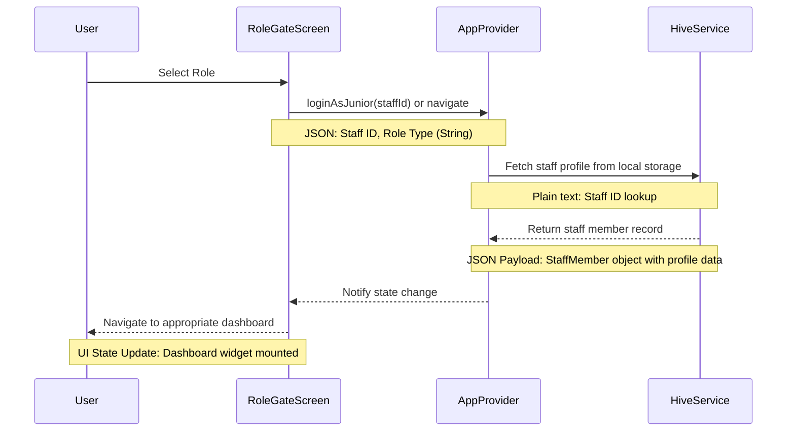
```mermaid
sequenceDiagram
    participant User
    participant RoleGateScreen
    participant AppProvider
    participant HiveService

    User->>RoleGateScreen: Select Role
    RoleGateScreen->>AppProvider: loginAsJunior(staffId) or navigate
    Note over RoleGateScreen,AppProvider: JSON: Staff ID, Role Type (String)
    AppProvider->>HiveService: Fetch staff profile from local storage
    Note over AppProvider,HiveService: Plain text: Staff ID lookup
    HiveService-->>AppProvider: Return staff member record
    Note over HiveService,AppProvider: JSON Payload: StaffMember object with profile data
    AppProvider-->>RoleGateScreen: Notify state change
    RoleGateScreen-->>User: Navigate to appropriate dashboard
    Note over RoleGateScreen,User: UI State Update: Dashboard widget mounted
```

---

## 2. Junior Staff Profile Setup

**User Role:** Junior Staff (New or Incomplete Setup)

**Screen:** `SetupProfileScreen` - Onboarding form for new staff members

**Functionality:**
New junior staff members must complete a profile setup form before accessing the main scheduling interface. This ensures all essential personal and professional information is captured for the organization's records. The form collects biographical data, language proficiencies, academic information, and communication preferences.

**Information Collected & Modified:**
- **Personal Information**: Full name, Kana name (Japanese phonetic), email, phone number, origin country
- **Academic Status**: Degree level (Bachelor's, Master's, PhD, Research)
- **Languages**: Native language + proficiency levels for secondary languages (Basic, Intermediate, Advanced)
- **Availability Mode**: Preferred modality (In-Person, Online, Both)
- **Personal Description**: Self-introduction text
- **Profile Picture**: Optional profile photo
- **Communication Preference**: Email or SNS (Social Media)
- **Affiliation**: Academic department or organizational unit

**Async Process Flowchart:**

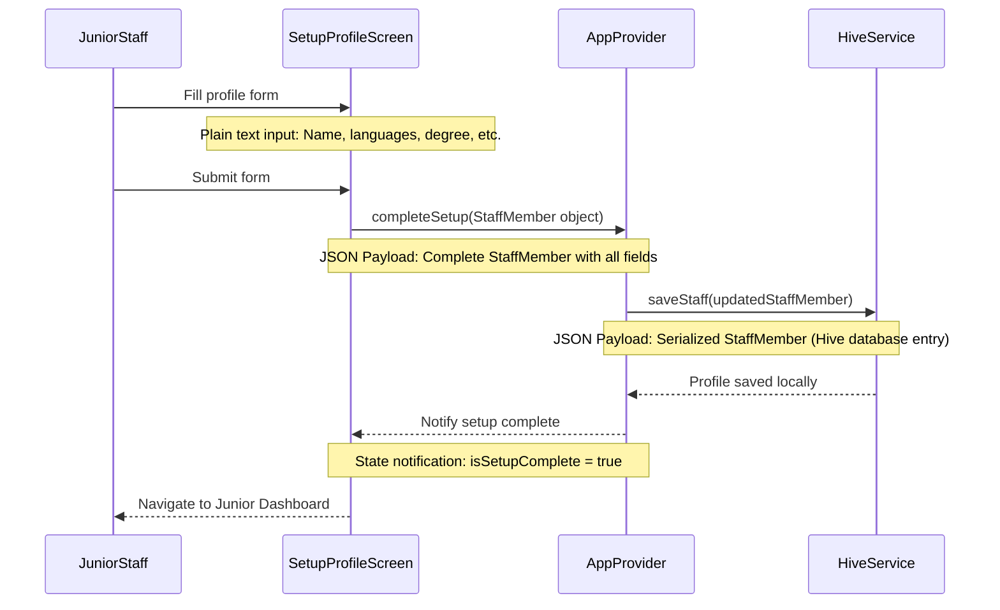
```mermaid
sequenceDiagram
    participant JuniorStaff
    participant SetupProfileScreen
    participant AppProvider
    participant HiveService

    JuniorStaff->>SetupProfileScreen: Fill profile form
    Note over SetupProfileScreen: Plain text input: Name, languages, degree, etc.
    JuniorStaff->>SetupProfileScreen: Submit form
    SetupProfileScreen->>AppProvider: completeSetup(StaffMember object)
    Note over SetupProfileScreen,AppProvider: JSON Payload: Complete StaffMember with all fields
    AppProvider->>HiveService: saveStaff(updatedStaffMember)
    Note over AppProvider,HiveService: JSON Payload: Serialized StaffMember (Hive database entry)
    HiveService-->>AppProvider: Profile saved locally
    AppProvider-->>SetupProfileScreen: Notify setup complete
    Note over AppProvider,SetupProfileScreen: State notification: isSetupComplete = true
    SetupProfileScreen-->>JuniorStaff: Navigate to Junior Dashboard
```

---

## 3. Junior Staff Schedule Submission

**User Role:** Junior Staff

**Screen:** `JuniorDashboard` - Schedule Tab (`_SchedulePainterView`)

**Functionality:**
Junior staff members propose their availability by selecting 30-minute time slots on a calendar interface. The system enforces business operating hours, holidays, employment status, and weekly hour limits. Staff can view their availability submissions in three calendar views (Day, Week, Month), modify existing proposals, or check approval status from senior staff.

**Information Provided, Required & Modified:**
- **Calendar View Modes**: Day (single 24-hour view), Week (7-day view), Month (calendar grid)
- **Time Slots**: 30-minute granular blocks within operating hours (typically 09:00-17:00)
- **Modality**: In-Person, Online, or Both (can be changed before approval)
- **Status Tracking**: Proposed, Approved, Rejected states with visual indicators
- **Emergency Replacement Flag**: Staff can mark slots needing replacement due to emergencies
- **Employment Status**: Blocks disabled if employment has ended

**Async Process Flowchart:**

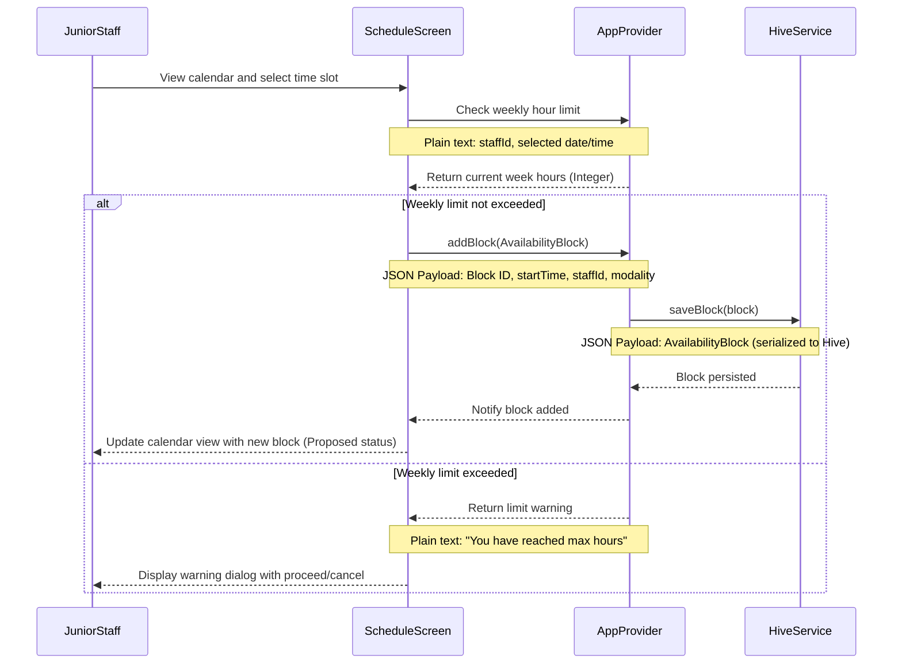
```mermaid
sequenceDiagram
    participant JuniorStaff
    participant ScheduleScreen
    participant AppProvider
    participant HiveService

    JuniorStaff->>ScheduleScreen: View calendar and select time slot
    ScheduleScreen->>AppProvider: Check weekly hour limit
    Note over ScheduleScreen,AppProvider: Plain text: staffId, selected date/time
    AppProvider-->>ScheduleScreen: Return current week hours (Integer)
    
    alt Weekly limit not exceeded
        ScheduleScreen->>AppProvider: addBlock(AvailabilityBlock)
        Note over ScheduleScreen,AppProvider: JSON Payload: Block ID, startTime, staffId, modality
        AppProvider->>HiveService: saveBlock(block)
        Note over AppProvider,HiveService: JSON Payload: AvailabilityBlock (serialized to Hive)
        HiveService-->>AppProvider: Block persisted
        AppProvider-->>ScheduleScreen: Notify block added
        ScheduleScreen-->>JuniorStaff: Update calendar view with new block (Proposed status)
    else Weekly limit exceeded
        AppProvider-->>ScheduleScreen: Return limit warning
        Note over AppProvider,ScheduleScreen: Plain text: "You have reached max hours"
        ScheduleScreen-->>JuniorStaff: Display warning dialog with proceed/cancel
    end
```

---

## 4. Working Hours Report Submission

**User Role:** Junior Staff

**Screen:** `JuniorDashboard` - Schedule Tab (after shifts are completed)

**Functionality:**
After completing an approved shift, junior staff submit a working report documenting actual hours worked, time confirmation (scheduled vs. actual), and a description of tasks performed. The system automatically groups contiguous 30-minute blocks into complete shifts and generates pending reports for shifts that have passed. Reports can only be submitted after a shift has ended (system compares current time against scheduled end time).

**Information Provided, Confirmed & Modified:**
- **Scheduled Time Range**: Auto-populated from approved blocks
- **Confirmed Start/End Time**: Actual clock-in/clock-out times (can differ from scheduled)
- **Work Description**: Text field describing activities, meetings attended, or assistance provided
- **Calculated Hours**: Auto-computed from confirmed start/end time (Float type with 2 decimals)
- **Associated External Meetings**: Auto-linked if external visitors were scheduled during shift
- **Report Date**: Locked to shift date

**Async Process Flowchart:**

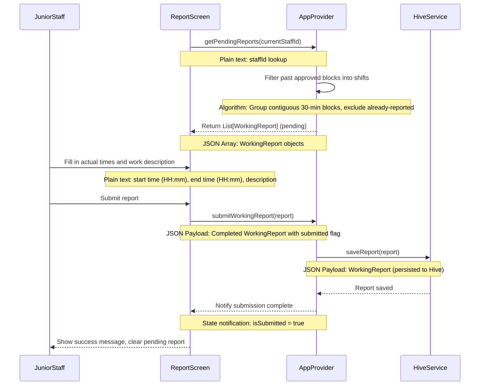
```mermaid
sequenceDiagram
    participant JuniorStaff
    participant ReportScreen
    participant AppProvider
    participant HiveService

    ReportScreen->>AppProvider: getPendingReports(currentStaffId)
    Note over ReportScreen,AppProvider: Plain text: staffId lookup
    AppProvider->>AppProvider: Filter past approved blocks into shifts
    Note over AppProvider: Algorithm: Group contiguous 30-min blocks, exclude already-reported
    AppProvider-->>ReportScreen: Return List[WorkingReport] (pending)
    Note over AppProvider,ReportScreen: JSON Array: WorkingReport objects
    
    JuniorStaff->>ReportScreen: Fill in actual times and work description
    Note over ReportScreen: Plain text: start time (HH:mm), end time (HH:mm), description
    JuniorStaff->>ReportScreen: Submit report
    
    ReportScreen->>AppProvider: submitWorkingReport(report)
    Note over ReportScreen,AppProvider: JSON Payload: Completed WorkingReport with submitted flag
    AppProvider->>HiveService: saveReport(report)
    Note over AppProvider,HiveService: JSON Payload: WorkingReport (persisted to Hive)
    HiveService-->>AppProvider: Report saved
    AppProvider-->>ReportScreen: Notify submission complete
    Note over AppProvider,ReportScreen: State notification: isSubmitted = true
    ReportScreen-->>JuniorStaff: Show success message, clear pending report
```

---

## 5. Event Proposal Submission

**User Role:** Junior Staff

**Screen:** `JuniorDashboard` - Event Proposal Tab (`_EventProposalView`)

**Functionality:**
Junior staff can propose new events for GCL, including workshops, social gatherings, or educational activities. Proposals are submitted to senior staff for review and approval. Once approved, junior staff can add event details like date, time, location, and post-event content (photos, summaries).

**Information Required, Provided & Modified:**
- **Event Title**: Name of the proposed event (Text)
- **Description**: Detailed explanation of event purpose and expected benefits
- **Proposed Date**: Initial date suggestion (can change after approval)
- **Proposer Name**: Auto-populated from current user profile
- **Status**: Proposed → Approved/Rejected (managed by senior staff)
- **Event Type**: Workshop, Social, Networking, Educational, etc.

**Async Process Flowchart:**

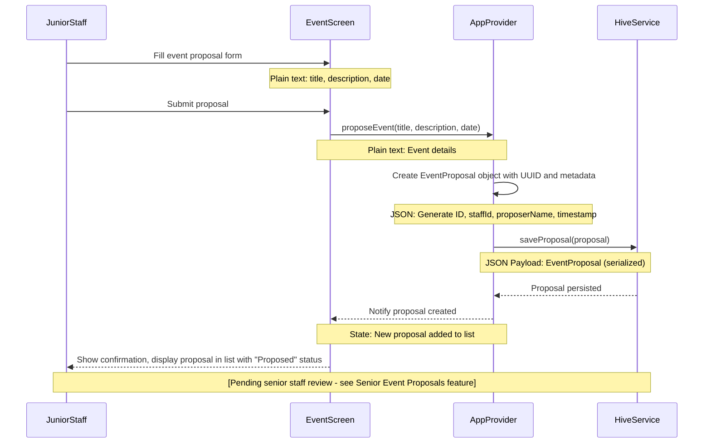
```mermaid
sequenceDiagram
    participant JuniorStaff
    participant EventScreen
    participant AppProvider
    participant HiveService

    JuniorStaff->>EventScreen: Fill event proposal form
    Note over EventScreen: Plain text: title, description, date
    JuniorStaff->>EventScreen: Submit proposal
    
    EventScreen->>AppProvider: proposeEvent(title, description, date)
    Note over EventScreen,AppProvider: Plain text: Event details
    AppProvider->>AppProvider: Create EventProposal object with UUID and metadata
    Note over AppProvider: JSON: Generate ID, staffId, proposerName, timestamp
    AppProvider->>HiveService: saveProposal(proposal)
    Note over AppProvider,HiveService: JSON Payload: EventProposal (serialized)
    HiveService-->>AppProvider: Proposal persisted
    AppProvider-->>EventScreen: Notify proposal created
    Note over AppProvider,EventScreen: State: New proposal added to list
    EventScreen-->>JuniorStaff: Show confirmation, display proposal in list with "Proposed" status
    
    Note over JuniorStaff,HiveService: [Pending senior staff review - see Senior Event Proposals feature]
```

---

## 6. Junior Staff Profile View

**User Role:** Junior Staff

**Screen:** `JuniorDashboard` - Profile Tab (`_ProfileView`)

**Functionality:**
Junior staff can view and edit their profile information. This is a read/update interface for personal data collected during setup. Unlike the initial setup, profile editing allows incremental updates without re-completing the entire form. Profile data is visible to senior staff on metrics dashboards.

**Information Displayed & Editable:**
- All setup profile fields (Name, Languages, Degree, Affiliation, etc.)
- Profile Picture
- Communication Preference
- Personal Description
- Kana Name
- Phone Number

**Async Process Flowchart:**

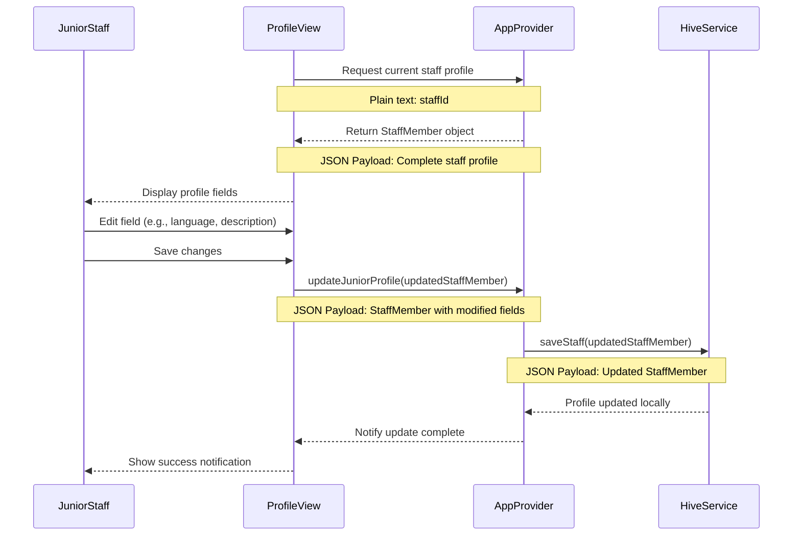
```mermaid
sequenceDiagram
    participant JuniorStaff
    participant ProfileView
    participant AppProvider
    participant HiveService

    ProfileView->>AppProvider: Request current staff profile
    Note over ProfileView,AppProvider: Plain text: staffId
    AppProvider-->>ProfileView: Return StaffMember object
    Note over AppProvider,ProfileView: JSON Payload: Complete staff profile
    ProfileView-->>JuniorStaff: Display profile fields

    JuniorStaff->>ProfileView: Edit field (e.g., language, description)
    JuniorStaff->>ProfileView: Save changes
    
    ProfileView->>AppProvider: updateJuniorProfile(updatedStaffMember)
    Note over ProfileView,AppProvider: JSON Payload: StaffMember with modified fields
    AppProvider->>HiveService: saveStaff(updatedStaffMember)
    Note over AppProvider,HiveService: JSON Payload: Updated StaffMember
    HiveService-->>AppProvider: Profile updated locally
    AppProvider-->>ProfileView: Notify update complete
    ProfileView-->>JuniorStaff: Show success notification
```

---

## 7. Senior Staff Metrics Dashboard

**User Role:** Senior Staff (Administrators)

**Screen:** `SeniorDashboard` - Metrics Tab (`_MetricsView`)

**Functionality:**
Senior staff access a comprehensive staff management dashboard displaying all team members with their key metrics and status information. This view enables quick overview of staff capabilities, availability patterns, engagement metrics, and performance indicators. Senior staff can search, sort, and filter staff by various criteria. They can also invite new staff, upgrade team members to senior roles, or terminate employment.

**Information Displayed & Managed:**
- **Staff List**: All junior and senior staff with searchable/sortable columns
- **Name & Avatar**: Visual identification (initials in circle)
- **Native Language**: Primary language
- **Other Languages**: Proficiency levels in secondary languages
- **Academic Degree**: Bachelors, Masters, PhD, Research
- **Availability Rate**: Percentage of offered time slots filled
- **Events Participation**: Count of events attended/organized
- **Assistance Provided**: Count of times staff helped others
- **Alerts**: Number of blocks needing emergency replacement
- **Employment Status**: Active or inactive; end date visible
- **Role Management**: Promote juniors to senior, manage employment end dates
- **Staff Invitation**: Email-based invitation to new candidates

**Async Process Flowchart:**

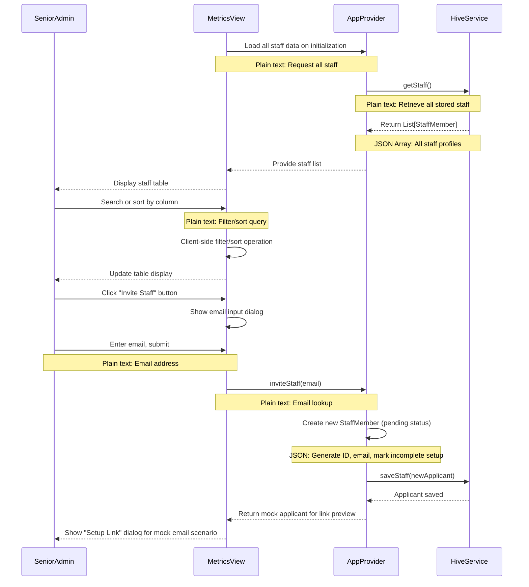
```mermaid
sequenceDiagram
    participant SeniorAdmin
    participant MetricsView
    participant AppProvider
    participant HiveService

    MetricsView->>AppProvider: Load all staff data on initialization
    Note over MetricsView,AppProvider: Plain text: Request all staff
    AppProvider->>HiveService: getStaff()
    Note over AppProvider,HiveService: Plain text: Retrieve all stored staff
    HiveService-->>AppProvider: Return List[StaffMember]
    Note over HiveService,AppProvider: JSON Array: All staff profiles
    AppProvider-->>MetricsView: Provide staff list
    MetricsView-->>SeniorAdmin: Display staff table

    SeniorAdmin->>MetricsView: Search or sort by column
    Note over MetricsView: Plain text: Filter/sort query
    MetricsView->>MetricsView: Client-side filter/sort operation
    MetricsView-->>SeniorAdmin: Update table display

    SeniorAdmin->>MetricsView: Click "Invite Staff" button
    MetricsView->>MetricsView: Show email input dialog
    SeniorAdmin->>MetricsView: Enter email, submit
    Note over SeniorAdmin,MetricsView: Plain text: Email address
    MetricsView->>AppProvider: inviteStaff(email)
    Note over MetricsView,AppProvider: Plain text: Email lookup
    AppProvider->>AppProvider: Create new StaffMember (pending status)
    Note over AppProvider: JSON: Generate ID, email, mark incomplete setup
    AppProvider->>HiveService: saveStaff(newApplicant)
    HiveService-->>AppProvider: Applicant saved
    AppProvider-->>MetricsView: Return mock applicant for link preview
    MetricsView-->>SeniorAdmin: Show "Setup Link" dialog for mock email scenario
```

---

## 8. Senior Staff Schedule Approval (Commander View)

**User Role:** Senior Staff (Administrators)

**Screen:** `SeniorDashboard` - Approval Tab (`_ApprovalTab`)

**Functionality:**
Senior staff review and approve/reject all availability submissions from junior staff. The interface displays proposed schedules organized by staff member and date, allowing bulk approval or individual rejection with optional comments. Approved blocks become locked in the system for meeting requests and working report calculations. Rejected blocks return to junior staff as rejected proposals that they must re-submit.

**Information Displayed & Managed:**
- **Pending Blocks**: All proposed (non-approved/rejected) availability submissions
- **Staff Identifier**: Name and profile info of submitting staff member
- **Date & Time Range**: Proposed availability period
- **Modality**: In-Person, Online, or Both options chosen by staff
- **Approval State**: Visual indicators (gray=pending, green=approved, red=rejected)
- **Bulk Actions**: Approve/Reject all for specific staff member + month
- **Comments/Notes**: Optional feedback when rejecting (planned feature)

**Async Process Flowchart:**

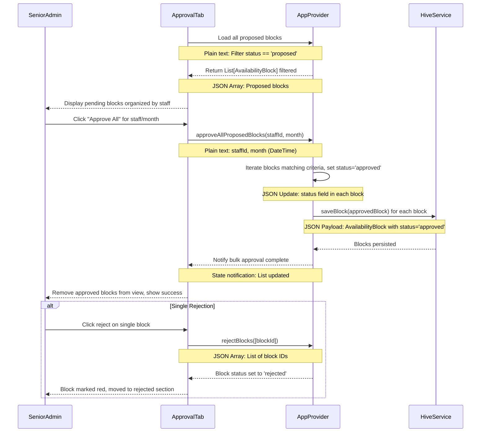
```mermaid
sequenceDiagram
    participant SeniorAdmin
    participant ApprovalTab
    participant AppProvider
    participant HiveService

    ApprovalTab->>AppProvider: Load all proposed blocks
    Note over ApprovalTab,AppProvider: Plain text: Filter status == 'proposed'
    AppProvider-->>ApprovalTab: Return List[AvailabilityBlock] filtered
    Note over AppProvider,ApprovalTab: JSON Array: Proposed blocks
    ApprovalTab-->>SeniorAdmin: Display pending blocks organized by staff

    SeniorAdmin->>ApprovalTab: Click "Approve All" for staff/month
    ApprovalTab->>AppProvider: approveAllProposedBlocks(staffId, month)
    Note over ApprovalTab,AppProvider: Plain text: staffId, month (DateTime)
    AppProvider->>AppProvider: Iterate blocks matching criteria, set status='approved'
    Note over AppProvider: JSON Update: status field in each block
    AppProvider->>HiveService: saveBlock(approvedBlock) for each block
    Note over AppProvider,HiveService: JSON Payload: AvailabilityBlock with status='approved'
    HiveService-->>AppProvider: Blocks persisted
    AppProvider-->>ApprovalTab: Notify bulk approval complete
    Note over AppProvider,ApprovalTab: State notification: List updated
    ApprovalTab-->>SeniorAdmin: Remove approved blocks from view, show success

    alt Single Rejection
        SeniorAdmin->>ApprovalTab: Click reject on single block
        ApprovalTab->>AppProvider: rejectBlocks([blockId])
        Note over ApprovalTab,AppProvider: JSON Array: List of block IDs
        AppProvider-->>ApprovalTab: Block status set to 'rejected'
        ApprovalTab-->>SeniorAdmin: Block marked red, moved to rejected section
    end
```

---

## 9. Senior Staff Working Reports Review

**User Role:** Senior Staff (Administrators)

**Screen:** `SeniorDashboard` - Working Reports Tab (`_WorkingReportsView`)

**Functionality:**
Senior staff review submitted working reports from all junior staff. This provides visibility into actual hours worked, tasks completed, and staff utilization. Reports can be filtered by staff member, date range, or status (submitted/pending). Senior staff can export reports to Excel for further analysis or compliance documentation.

**Information Displayed & Reviewed:**
- **Staff Member**: Name and profile identifier
- **Report Date**: Date of reported work
- **Scheduled Time**: Originally approved time range
- **Confirmed Time**: Actual clock-in/clock-out times
- **Worked Hours**: Calculated duration (Float)
- **Work Done**: Description of activities and tasks
- **External Meetings**: Associated external visitor meetings
- **Status**: Submitted or draft
- **Export Options**: Individual or bulk Excel export by staff member

**Async Process Flowchart:**

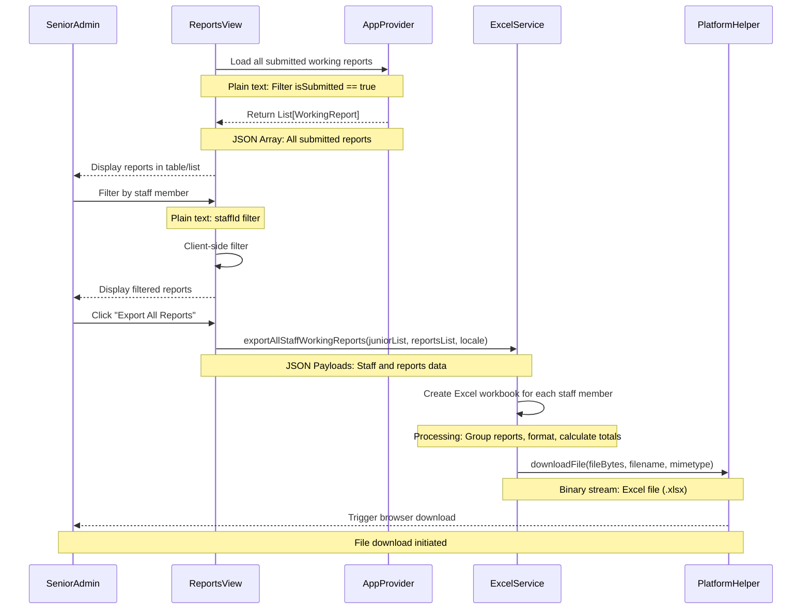
```mermaid
sequenceDiagram
    participant SeniorAdmin
    participant ReportsView
    participant AppProvider
    participant ExcelService
    participant PlatformHelper

    ReportsView->>AppProvider: Load all submitted working reports
    Note over ReportsView,AppProvider: Plain text: Filter isSubmitted == true
    AppProvider-->>ReportsView: Return List[WorkingReport]
    Note over AppProvider,ReportsView: JSON Array: All submitted reports
    ReportsView-->>SeniorAdmin: Display reports in table/list

    SeniorAdmin->>ReportsView: Filter by staff member
    Note over ReportsView: Plain text: staffId filter
    ReportsView->>ReportsView: Client-side filter
    ReportsView-->>SeniorAdmin: Display filtered reports

    SeniorAdmin->>ReportsView: Click "Export All Reports"
    ReportsView->>ExcelService: exportAllStaffWorkingReports(juniorList, reportsList, locale)
    Note over ReportsView,ExcelService: JSON Payloads: Staff and reports data
    ExcelService->>ExcelService: Create Excel workbook for each staff member
    Note over ExcelService: Processing: Group reports, format, calculate totals
    ExcelService->>PlatformHelper: downloadFile(fileBytes, filename, mimetype)
    Note over ExcelService,PlatformHelper: Binary stream: Excel file (.xlsx)
    PlatformHelper-->>SeniorAdmin: Trigger browser download
    Note over PlatformHelper,SeniorAdmin: File download initiated
```

---

## 10. Senior Staff Event Proposals Review

**User Role:** Senior Staff (Administrators)

**Screen:** `SeniorDashboard` - Event Proposals Tab (`_EventProposalsTab`)

**Functionality:**
Senior staff review event proposals submitted by junior staff. They can approve or reject proposals. Once approved, proposals move to an active event planning state where junior staff can add event details (date, time, location, photos, summary). The system tracks event status from proposal through completion, enabling event history and analytics.

**Information Displayed & Managed:**
- **Proposal Title**: Event name
- **Proposer Name**: Junior staff member who submitted
- **Proposed Date**: Suggested date for event
- **Description**: Event purpose and details
- **Status**: Proposed → Approved/Rejected
- **Proposal Date**: Submission timestamp
- **Post-Event Content**: Once approved, fields for date confirmation, photos, summary

**Async Process Flowchart:**

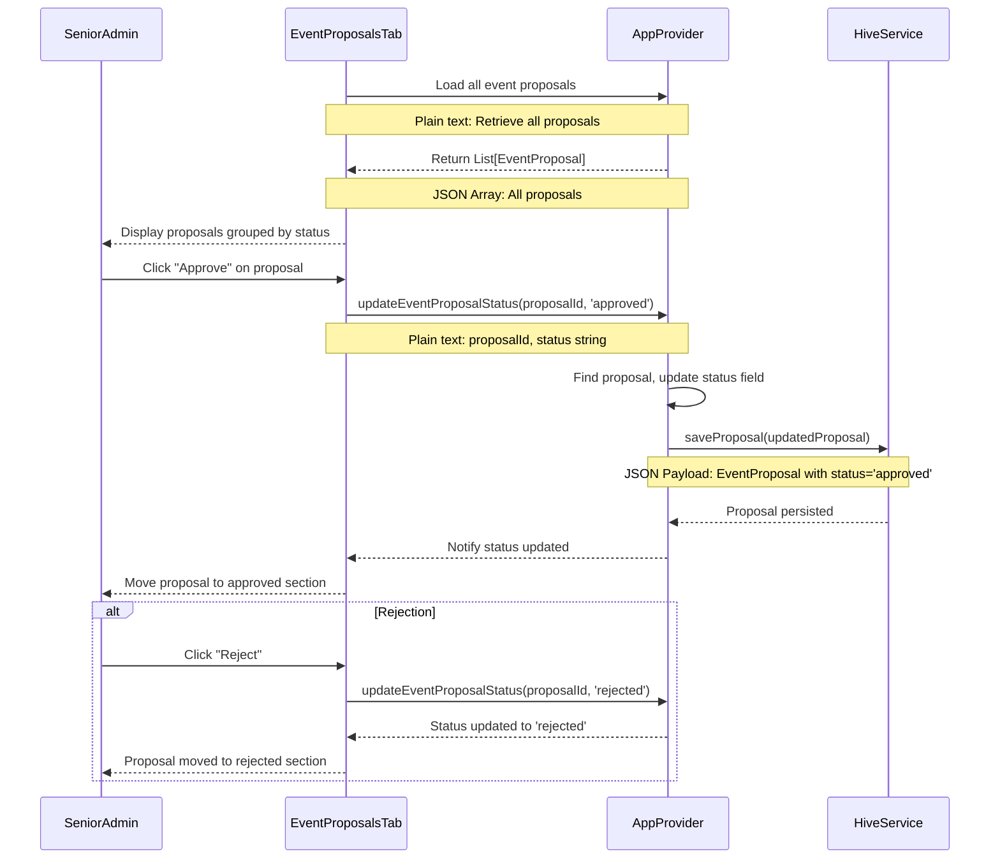
```mermaid
sequenceDiagram
    participant SeniorAdmin
    participant EventProposalsTab
    participant AppProvider
    participant HiveService

    EventProposalsTab->>AppProvider: Load all event proposals
    Note over EventProposalsTab,AppProvider: Plain text: Retrieve all proposals
    AppProvider-->>EventProposalsTab: Return List[EventProposal]
    Note over AppProvider,EventProposalsTab: JSON Array: All proposals
    EventProposalsTab-->>SeniorAdmin: Display proposals grouped by status

    SeniorAdmin->>EventProposalsTab: Click "Approve" on proposal
    EventProposalsTab->>AppProvider: updateEventProposalStatus(proposalId, 'approved')
    Note over EventProposalsTab,AppProvider: Plain text: proposalId, status string
    AppProvider->>AppProvider: Find proposal, update status field
    AppProvider->>HiveService: saveProposal(updatedProposal)
    Note over AppProvider,HiveService: JSON Payload: EventProposal with status='approved'
    HiveService-->>AppProvider: Proposal persisted
    AppProvider-->>EventProposalsTab: Notify status updated
    EventProposalsTab-->>SeniorAdmin: Move proposal to approved section

    alt Rejection
        SeniorAdmin->>EventProposalsTab: Click "Reject"
        EventProposalsTab->>AppProvider: updateEventProposalStatus(proposalId, 'rejected')
        AppProvider-->>EventProposalsTab: Status updated to 'rejected'
        EventProposalsTab-->>SeniorAdmin: Proposal moved to rejected section
    end
```

---

## 11. External Meeting Request Management

**User Role:** Senior Staff (Reviewers) & External Visitors (Requesters)

**Screen:** 
- External: `ExternalMeetingRequestScreen` (form for external visitors)
- Senior: `SeniorDashboard` - Meeting Requests Tab (`_MeetingRequestsTab`)

**Functionality:**
External visitors (students, researchers, business partners) can request meetings with GCL staff. Visitors fill a form with meeting details and preferred time/modality. Senior staff review requests, approve/reject, and assign available junior staff members to meetings. Approved meetings are visible to junior staff during their shift, and working reports automatically link to associated meetings.

**Information Collected from External Visitors:**
- **Visitor Name**: Full name
- **Department**: Academic or organizational affiliation
- **Study Year/Grade**: Student level or professional position
- **Purpose**: Assignment help, conversation practice, presentation feedback, etc.
- **Purpose Language**: English or Japanese instruction level
- **Meeting Type**: Online or In-Person
- **Requested Date**: Preferred date for meeting
- **Requested Time**: Specific time slot (30-minute windows available)

**Information Managed by Senior Staff:**
- **Request Status**: Pending → Approved/Rejected
- **Assigned Staff Member**: Junior staff assigned to conduct meeting
- **Scheduled Time**: Confirmed date and time
- **Location**: In-person location or video link
- **Notes/Feedback**: Optional comments

**Async Process Flowchart:**

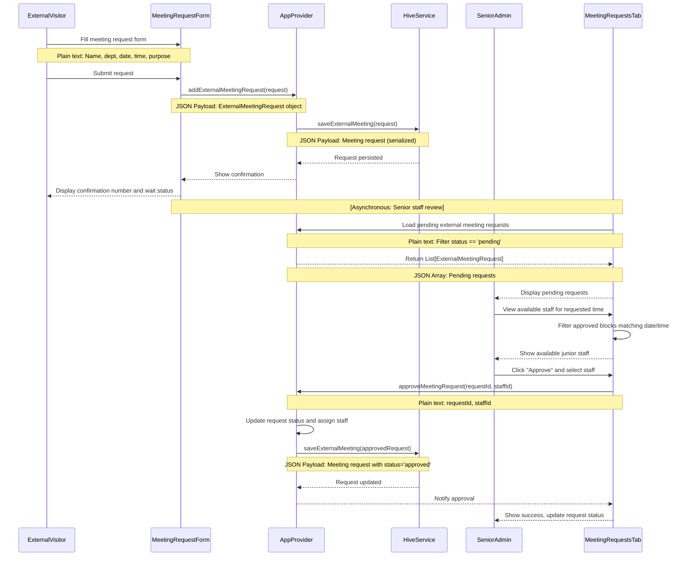
```mermaid
sequenceDiagram
    participant ExternalVisitor
    participant MeetingRequestForm
    participant AppProvider
    participant HiveService
    participant SeniorAdmin
    participant MeetingRequestsTab

    ExternalVisitor->>MeetingRequestForm: Fill meeting request form
    Note over ExternalVisitor,MeetingRequestForm: Plain text: Name, dept, date, time, purpose
    ExternalVisitor->>MeetingRequestForm: Submit request
    
    MeetingRequestForm->>AppProvider: addExternalMeetingRequest(request)
    Note over MeetingRequestForm,AppProvider: JSON Payload: ExternalMeetingRequest object
    AppProvider->>HiveService: saveExternalMeeting(request)
    Note over AppProvider,HiveService: JSON Payload: Meeting request (serialized)
    HiveService-->>AppProvider: Request persisted
    AppProvider-->>MeetingRequestForm: Show confirmation
    MeetingRequestForm-->>ExternalVisitor: Display confirmation number and wait status

    Note over MeetingRequestForm,MeetingRequestsTab: [Asynchronous: Senior staff review]

    MeetingRequestsTab->>AppProvider: Load pending external meeting requests
    Note over MeetingRequestsTab,AppProvider: Plain text: Filter status == 'pending'
    AppProvider-->>MeetingRequestsTab: Return List[ExternalMeetingRequest]
    Note over AppProvider,MeetingRequestsTab: JSON Array: Pending requests
    MeetingRequestsTab-->>SeniorAdmin: Display pending requests

    SeniorAdmin->>MeetingRequestsTab: View available staff for requested time
    MeetingRequestsTab->>MeetingRequestsTab: Filter approved blocks matching date/time
    MeetingRequestsTab-->>SeniorAdmin: Show available junior staff

    SeniorAdmin->>MeetingRequestsTab: Click "Approve" and select staff
    MeetingRequestsTab->>AppProvider: approveMeetingRequest(requestId, staffId)
    Note over MeetingRequestsTab,AppProvider: Plain text: requestId, staffId
    AppProvider->>AppProvider: Update request status and assign staff
    AppProvider->>HiveService: saveExternalMeeting(approvedRequest)
    Note over AppProvider,HiveService: JSON Payload: Meeting request with status='approved'
    HiveService-->>AppProvider: Request updated
    AppProvider-->>MeetingRequestsTab: Notify approval
    MeetingRequestsTab-->>SeniorAdmin: Show success, update request status
```

---

## 12. Operating Hours & Guardrails Configuration

**User Role:** Senior Staff (System Administrators)

**Screen:** `SeniorDashboard` - Guardrails Tab (`_GuardrailsView`)

**Functionality:**
Senior staff define system-wide operating hours and constraints. These guardrails enforce business rules across all staff scheduling. The configuration includes daily operating hours, holiday definitions, and maximum weekly hour limits per staff member. Changes apply immediately to the system and affect which time slots are available for junior staff to select.

**Information Configured:**
- **Weekly Operating Hours**: Start and end time for each day (Monday-Sunday)
- **Closed Days**: Toggle to mark days as fully closed
- **Holidays**: Add/remove specific holiday dates with optional time ranges (all-day or partial-day)
- **Holiday Messages**: Custom text displayed to staff on holiday dates
- **Maximum Weekly Hours Limit**: Optional cap on total hours per staff per week (e.g., 20 hours max)
- **Partial-Day Holidays**: Define specific time ranges as blocked even on working days

**Async Process Flowchart:**

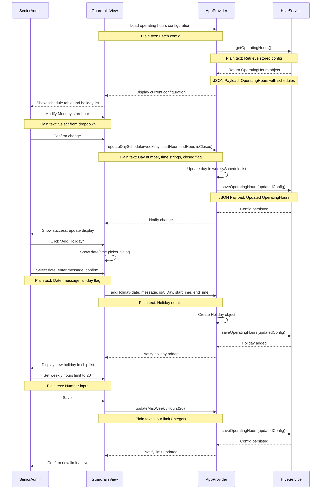
```mermaid
sequenceDiagram
    participant SeniorAdmin
    participant GuardrailsView
    participant AppProvider
    participant HiveService

    GuardrailsView->>AppProvider: Load operating hours configuration
    Note over GuardrailsView,AppProvider: Plain text: Fetch config
    AppProvider->>HiveService: getOperatingHours()
    Note over AppProvider,HiveService: Plain text: Retrieve stored config
    HiveService-->>AppProvider: Return OperatingHours object
    Note over HiveService,AppProvider: JSON Payload: OperatingHours with schedules
    AppProvider-->>GuardrailsView: Display current configuration
    GuardrailsView-->>SeniorAdmin: Show schedule table and holiday list

    SeniorAdmin->>GuardrailsView: Modify Monday start hour
    Note over SeniorAdmin,GuardrailsView: Plain text: Select from dropdown
    SeniorAdmin->>GuardrailsView: Confirm change
    GuardrailsView->>AppProvider: updateDaySchedule(weekday, startHour, endHour, isClosed)
    Note over GuardrailsView,AppProvider: Plain text: Day number, time strings, closed flag
    AppProvider->>AppProvider: Update day in weeklySchedule list
    AppProvider->>HiveService: saveOperatingHours(updatedConfig)
    Note over AppProvider,HiveService: JSON Payload: Updated OperatingHours
    HiveService-->>AppProvider: Config persisted
    AppProvider-->>GuardrailsView: Notify change
    GuardrailsView-->>SeniorAdmin: Show success, update display

    SeniorAdmin->>GuardrailsView: Click "Add Holiday"
    GuardrailsView->>GuardrailsView: Show date/time picker dialog
    SeniorAdmin->>GuardrailsView: Select date, enter message, confirm
    Note over SeniorAdmin,GuardrailsView: Plain text: Date, message, all-day flag
    GuardrailsView->>AppProvider: addHoliday(date, message, isAllDay, startTime, endTime)
    Note over GuardrailsView,AppProvider: Plain text: Holiday details
    AppProvider->>AppProvider: Create Holiday object
    AppProvider->>HiveService: saveOperatingHours(updatedConfig)
    HiveService-->>AppProvider: Holiday added
    AppProvider-->>GuardrailsView: Notify holiday added
    GuardrailsView-->>SeniorAdmin: Display new holiday in chip list

    SeniorAdmin->>GuardrailsView: Set weekly hours limit to 20
    Note over SeniorAdmin,GuardrailsView: Plain text: Number input
    SeniorAdmin->>GuardrailsView: Save
    GuardrailsView->>AppProvider: updateMaxWeeklyHours(20)
    Note over GuardrailsView,AppProvider: Plain text: Hour limit (Integer)
    AppProvider->>HiveService: saveOperatingHours(updatedConfig)
    HiveService-->>AppProvider: Config persisted
    AppProvider-->>GuardrailsView: Notify limit updated
    GuardrailsView-->>SeniorAdmin: Confirm new limit active
```

---

## 13. Data Export & Excel Reports

**User Role:** Senior Staff, Developer

**Screen:** `SeniorDashboard` - Multiple export options via toolbar buttons

**Functionality:**
The system provides comprehensive export functionality to download data in Excel (.xlsx) format for external analysis, compliance, or archival. Exports include staff metrics, master calendars, and working reports. Each export creates properly formatted Excel workbooks with headers, translations (English/Japanese), and calculated totals.

**Export Types & Information Included:**

**1. Staff Metrics Export (`exportStaffData`):**
- Staff names and profiles
- Native language and proficiency in other languages
- Academic degrees
- Availability metrics (rate percentage)
- Event participation counts
- Assistance provided counts
- Communication preferences

**2. Master Calendar Export (`exportMasterCalendarMonthly`):**
- Date and time grid (all days and time slots for month)
- Each junior staff member as column
- Availability symbols (○ for online, blocks for in-person)
- Modality indicators
- Month and year labeling

**3. Working Reports Export (`exportAllStaffWorkingReports`):**
- Individual workbooks per staff member
- Staff name, Kana name, affiliation header
- Report date, scheduled/confirmed times, hours worked
- Work description
- Running total of hours per staff member

**Async Process Flowchart:**

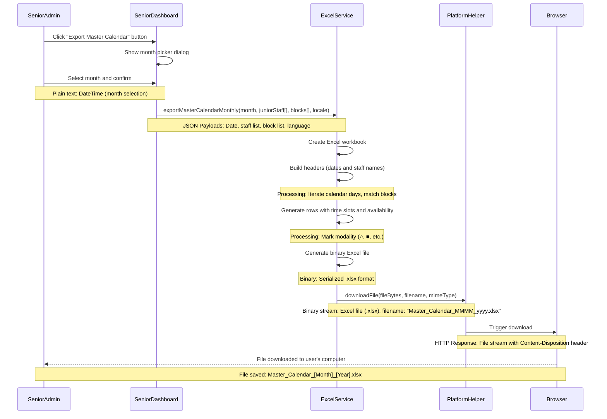
```mermaid
sequenceDiagram
    participant SeniorAdmin
    participant SeniorDashboard
    participant ExcelService
    participant PlatformHelper
    participant Browser

    SeniorAdmin->>SeniorDashboard: Click "Export Master Calendar" button
    SeniorDashboard->>SeniorDashboard: Show month picker dialog
    SeniorAdmin->>SeniorDashboard: Select month and confirm
    Note over SeniorAdmin,SeniorDashboard: Plain text: DateTime (month selection)
    
    SeniorDashboard->>ExcelService: exportMasterCalendarMonthly(month, juniorStaff[], blocks[], locale)
    Note over SeniorDashboard,ExcelService: JSON Payloads: Date, staff list, block list, language
    
    ExcelService->>ExcelService: Create Excel workbook
    ExcelService->>ExcelService: Build headers (dates and staff names)
    Note over ExcelService: Processing: Iterate calendar days, match blocks
    ExcelService->>ExcelService: Generate rows with time slots and availability
    Note over ExcelService: Processing: Mark modality (○, ■, etc.)
    
    ExcelService->>ExcelService: Generate binary Excel file
    Note over ExcelService: Binary: Serialized .xlsx format
    
    ExcelService->>PlatformHelper: downloadFile(fileBytes, filename, mimeType)
    Note over ExcelService,PlatformHelper: Binary stream: Excel file (.xlsx), filename: "Master_Calendar_MMMM_yyyy.xlsx"
    
    PlatformHelper->>Browser: Trigger download
    Note over PlatformHelper,Browser: HTTP Response: File stream with Content-Disposition header
    Browser-->>SeniorAdmin: File downloaded to user's computer
    Note over Browser,SeniorAdmin: File saved: Master_Calendar_[Month]_[Year].xlsx
```

---

## 14. Staff Information Management & Upgrades

**User Role:** Senior Staff (Administrators)

**Screen:** `SeniorDashboard` - Metrics Tab (staff management row actions)

**Functionality:**
Senior staff can manage the entire staff lifecycle: invite new candidates, promote juniors to senior roles, terminate employment, or end employee dates. These actions update staff records and affect system permissions and access levels.

**Staff Lifecycle Actions:**

**Invite New Staff:**
- Enter candidate's email
- System generates invitation link (mock email scenario for demo)
- Candidate completes profile setup
- Status changes from "Pending Applicant" to active

**Upgrade to Senior:**
- Click "Upgrade to Senior" button on junior staff row
- Immediately grants senior staff permissions
- Staff can now see administrative dashboards

**Finish Employment:**
- Click exit button on staff row
- Optionally specify end date
- Staff access disabled after end date (if set)
- Historical data preserved for reporting

**Async Process Flowchart:**

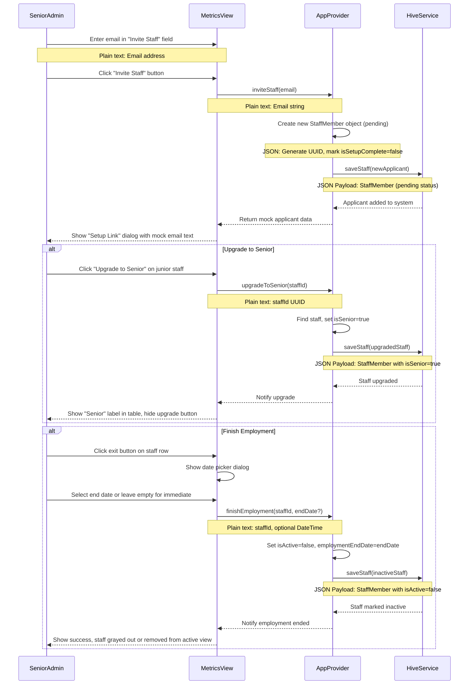
```mermaid
sequenceDiagram
    participant SeniorAdmin
    participant MetricsView
    participant AppProvider
    participant HiveService

    SeniorAdmin->>MetricsView: Enter email in "Invite Staff" field
    Note over SeniorAdmin,MetricsView: Plain text: Email address
    SeniorAdmin->>MetricsView: Click "Invite Staff" button
    
    MetricsView->>AppProvider: inviteStaff(email)
    Note over MetricsView,AppProvider: Plain text: Email string
    AppProvider->>AppProvider: Create new StaffMember object (pending)
    Note over AppProvider: JSON: Generate UUID, mark isSetupComplete=false
    AppProvider->>HiveService: saveStaff(newApplicant)
    Note over AppProvider,HiveService: JSON Payload: StaffMember (pending status)
    HiveService-->>AppProvider: Applicant added to system
    AppProvider-->>MetricsView: Return mock applicant data
    MetricsView-->>SeniorAdmin: Show "Setup Link" dialog with mock email text

    alt Upgrade to Senior
        SeniorAdmin->>MetricsView: Click "Upgrade to Senior" on junior staff
        MetricsView->>AppProvider: upgradeToSenior(staffId)
        Note over MetricsView,AppProvider: Plain text: staffId UUID
        AppProvider->>AppProvider: Find staff, set isSenior=true
        AppProvider->>HiveService: saveStaff(upgradedStaff)
        Note over AppProvider,HiveService: JSON Payload: StaffMember with isSenior=true
        HiveService-->>AppProvider: Staff upgraded
        AppProvider-->>MetricsView: Notify upgrade
        MetricsView-->>SeniorAdmin: Show "Senior" label in table, hide upgrade button
    end

    alt Finish Employment
        SeniorAdmin->>MetricsView: Click exit button on staff row
        MetricsView->>MetricsView: Show date picker dialog
        SeniorAdmin->>MetricsView: Select end date or leave empty for immediate
        MetricsView->>AppProvider: finishEmployment(staffId, endDate?)
        Note over MetricsView,AppProvider: Plain text: staffId, optional DateTime
        AppProvider->>AppProvider: Set isActive=false, employmentEndDate=endDate
        AppProvider->>HiveService: saveStaff(inactiveStaff)
        Note over AppProvider,HiveService: JSON Payload: StaffMember with isActive=false
        HiveService-->>AppProvider: Staff marked inactive
        AppProvider-->>MetricsView: Notify employment ended
        MetricsView-->>SeniorAdmin: Show success, staff grayed out or removed from active view
    end
```

---

## 15. Data Import (JSON/CSV)

**User Role:** Developer, Senior Staff (Administrators)

**Screen:** `SeniorDashboard` - Metrics Tab (import buttons)

**Functionality:**
Administrators can bulk import staff data and availability blocks from external JSON or CSV files. This is useful for onboarding large teams or migrating data from legacy systems. The import process matches file data to staff members and creates availability blocks or event proposals.

**Import File Formats:**

**JSON Staff Import:**
```json
[
  {
    "id": "uuid",
    "name": "John Doe",
    "email": "john@example.com",
    "nativeLanguage": "English",
    "degree": "Bachelors",
    "modalityPreference": "Both",
    "languageSkills": [
      {"language": "Japanese", "proficiency": "Advanced"}
    ]
  }
]
```

**JSON/CSV Data Import (Blocks & Events):**
- Type: BLOCK or EVENT
- Email: Staff member identifier
- Date, Start, End: Time range
- Modality: In-Person, Online, Both

**Async Process Flowchart:**

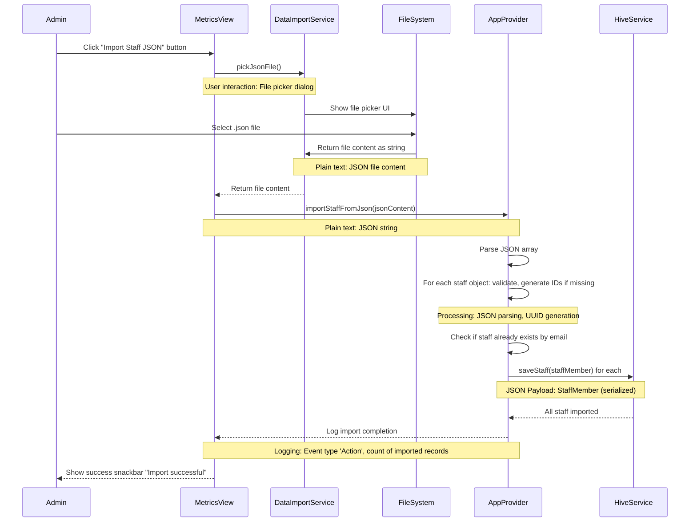
```mermaid
sequenceDiagram
    participant Admin
    participant MetricsView
    participant DataImportService
    participant FileSystem
    participant AppProvider
    participant HiveService

    Admin->>MetricsView: Click "Import Staff JSON" button
    MetricsView->>DataImportService: pickJsonFile()
    Note over MetricsView,DataImportService: User interaction: File picker dialog
    DataImportService->>FileSystem: Show file picker UI
    Admin->>FileSystem: Select .json file
    FileSystem->>DataImportService: Return file content as string
    Note over FileSystem,DataImportService: Plain text: JSON file content
    
    DataImportService-->>MetricsView: Return file content
    MetricsView->>AppProvider: importStaffFromJson(jsonContent)
    Note over MetricsView,AppProvider: Plain text: JSON string
    
    AppProvider->>AppProvider: Parse JSON array
    AppProvider->>AppProvider: For each staff object: validate, generate IDs if missing
    Note over AppProvider: Processing: JSON parsing, UUID generation
    AppProvider->>AppProvider: Check if staff already exists by email
    AppProvider->>HiveService: saveStaff(staffMember) for each
    Note over AppProvider,HiveService: JSON Payload: StaffMember (serialized)
    HiveService-->>AppProvider: All staff imported
    AppProvider-->>MetricsView: Log import completion
    Note over AppProvider,MetricsView: Logging: Event type 'Action', count of imported records
    MetricsView-->>Admin: Show success snackbar "Import successful"
```

---

## 16. Language & Theme Customization

**User Role:** All Users

**Screen:** App-wide (accessible from toolbar on all dashboards)

**Functionality:**
The application supports bilingual interface (English and Japanese) and light/dark theme modes. Users can switch language and theme preferences globally, and preferences are saved locally.

**Options:**
- **Languages**: English, Japanese (auto-detected from browser settings)
- **Themes**: Light mode, Dark mode

**Async Process Flowchart:**

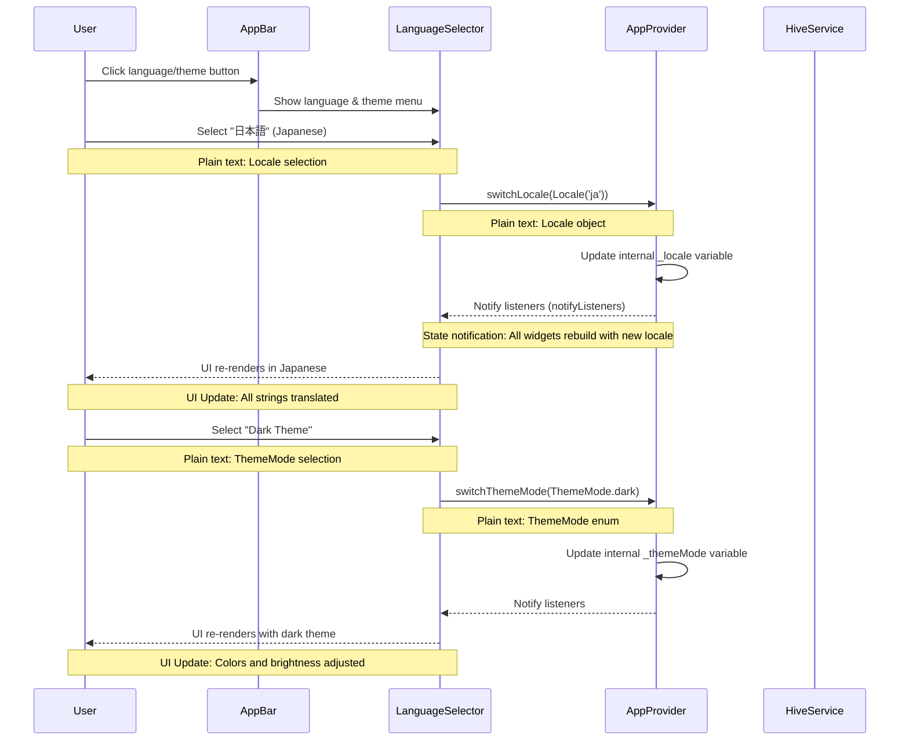
```mermaid
sequenceDiagram
    participant User
    participant AppBar
    participant LanguageSelector
    participant AppProvider
    participant HiveService

    User->>AppBar: Click language/theme button
    AppBar->>LanguageSelector: Show language & theme menu
    
    User->>LanguageSelector: Select "日本語" (Japanese)
    Note over User,LanguageSelector: Plain text: Locale selection
    LanguageSelector->>AppProvider: switchLocale(Locale('ja'))
    Note over LanguageSelector,AppProvider: Plain text: Locale object
    AppProvider->>AppProvider: Update internal _locale variable
    AppProvider-->>LanguageSelector: Notify listeners (notifyListeners)
    Note over AppProvider,LanguageSelector: State notification: All widgets rebuild with new locale
    LanguageSelector-->>User: UI re-renders in Japanese
    Note over LanguageSelector,User: UI Update: All strings translated

    User->>LanguageSelector: Select "Dark Theme"
    Note over User,LanguageSelector: Plain text: ThemeMode selection
    LanguageSelector->>AppProvider: switchThemeMode(ThemeMode.dark)
    Note over LanguageSelector,AppProvider: Plain text: ThemeMode enum
    AppProvider->>AppProvider: Update internal _themeMode variable
    AppProvider-->>LanguageSelector: Notify listeners
    LanguageSelector-->>User: UI re-renders with dark theme
    Note over LanguageSelector,User: UI Update: Colors and brightness adjusted
```

---

## 17. Social Media Metrics Dashboard

**User Role:** Senior Staff (Administrators)

**Screen:** `SeniorDashboard` - Social Metrics Tab (`SocialDashboardTab`)

**Functionality:**
Senior staff monitor GCL's social media presence through a centralized dashboard. The system fetches real-time metrics from YouTube and Instagram using official APIs (with fallback to web scraping). Metrics include subscriber counts, view counts, follower counts, and post engagement data.

**Information Tracked:**
- **YouTube**: Channel subscriber count, total view count
- **Instagram**: Follower count, media (post) count
- **X (Twitter)**: Follower count, tweet engagement (pending implementation)
- **Data Source**: Official API or web scraper fallback
- **Last Updated**: Timestamp of last metric refresh

**Async Process Flowchart:**

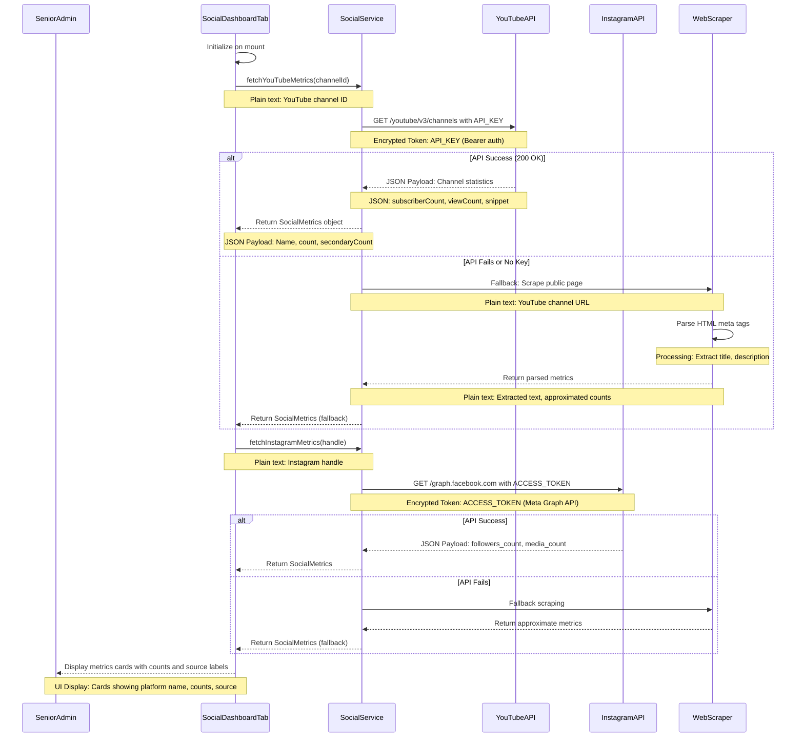
```mermaid
sequenceDiagram
    participant SeniorAdmin
    participant SocialDashboardTab
    participant SocialService
    participant YouTubeAPI
    participant InstagramAPI
    participant WebScraper

    SocialDashboardTab->>SocialDashboardTab: Initialize on mount
    
    SocialDashboardTab->>SocialService: fetchYouTubeMetrics(channelId)
    Note over SocialDashboardTab,SocialService: Plain text: YouTube channel ID
    
    SocialService->>YouTubeAPI: GET /youtube/v3/channels with API_KEY
    Note over SocialService,YouTubeAPI: Encrypted Token: API_KEY (Bearer auth)
    
    alt API Success (200 OK)
        YouTubeAPI-->>SocialService: JSON Payload: Channel statistics
        Note over YouTubeAPI,SocialService: JSON: subscriberCount, viewCount, snippet
        SocialService-->>SocialDashboardTab: Return SocialMetrics object
        Note over SocialService,SocialDashboardTab: JSON Payload: Name, count, secondaryCount
    else API Fails or No Key
        SocialService->>WebScraper: Fallback: Scrape public page
        Note over SocialService,WebScraper: Plain text: YouTube channel URL
        WebScraper->>WebScraper: Parse HTML meta tags
        Note over WebScraper: Processing: Extract title, description
        WebScraper-->>SocialService: Return parsed metrics
        Note over WebScraper,SocialService: Plain text: Extracted text, approximated counts
        SocialService-->>SocialDashboardTab: Return SocialMetrics (fallback)
    end

    SocialDashboardTab->>SocialService: fetchInstagramMetrics(handle)
    Note over SocialDashboardTab,SocialService: Plain text: Instagram handle
    
    SocialService->>InstagramAPI: GET /graph.facebook.com with ACCESS_TOKEN
    Note over SocialService,InstagramAPI: Encrypted Token: ACCESS_TOKEN (Meta Graph API)
    
    alt API Success
        InstagramAPI-->>SocialService: JSON Payload: followers_count, media_count
        SocialService-->>SocialDashboardTab: Return SocialMetrics
    else API Fails
        SocialService->>WebScraper: Fallback scraping
        WebScraper-->>SocialService: Return approximate metrics
        SocialService-->>SocialDashboardTab: Return SocialMetrics (fallback)
    end

    SocialDashboardTab-->>SeniorAdmin: Display metrics cards with counts and source labels
    Note over SocialDashboardTab,SeniorAdmin: UI Display: Cards showing platform name, counts, source
```

---

## 18. Chart Visualizations & Analytics

**User Role:** Senior Staff (Administrators)

**Screen:** `SeniorDashboard` - Charts Tab (`ChartVisualizationTab`)

**Functionality:**
Senior staff view dynamic charts and analytics visualizations providing insights into staff utilization, availability patterns, language proficiency distribution, and academic composition. Charts help administrators identify gaps, trends, and optimization opportunities.

**Charts Generated:**
1. **Approved Hours Histogram**: Total approved hours per time block across all staff
2. **Language Proficiency Bar Chart**: Number of speakers per language at each proficiency level
3. **Cumulative Hours Line Chart**: Per-staff accumulated worked hours over time
4. **Academic Status Column Chart**: Distribution of staff by degree level (Bachelor's, Master's, PhD, Research)

**Data Sources:**
- AvailabilityBlock status and timing
- LanguageSkill proficiency levels
- StaffMember degree information
- WorkingReport confirmed hours

**Async Process Flowchart:**

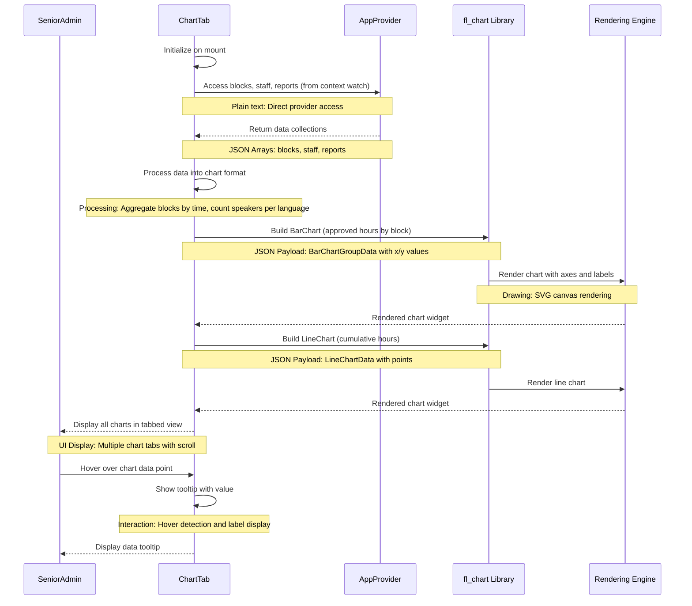
```mermaid
sequenceDiagram
    participant SeniorAdmin
    participant ChartTab
    participant AppProvider
    participant fl_chart Library
    participant Rendering Engine

    ChartTab->>ChartTab: Initialize on mount
    ChartTab->>AppProvider: Access blocks, staff, reports (from context watch)
    Note over ChartTab,AppProvider: Plain text: Direct provider access
    AppProvider-->>ChartTab: Return data collections
    Note over AppProvider,ChartTab: JSON Arrays: blocks, staff, reports

    ChartTab->>ChartTab: Process data into chart format
    Note over ChartTab: Processing: Aggregate blocks by time, count speakers per language

    ChartTab->>fl_chart Library: Build BarChart (approved hours by block)
    Note over ChartTab,fl_chart Library: JSON Payload: BarChartGroupData with x/y values
    fl_chart Library->>Rendering Engine: Render chart with axes and labels
    Note over fl_chart Library,Rendering Engine: Drawing: SVG canvas rendering
    Rendering Engine-->>ChartTab: Rendered chart widget
    
    ChartTab->>fl_chart Library: Build LineChart (cumulative hours)
    Note over ChartTab,fl_chart Library: JSON Payload: LineChartData with points
    fl_chart Library->>Rendering Engine: Render line chart
    Rendering Engine-->>ChartTab: Rendered chart widget

    ChartTab-->>SeniorAdmin: Display all charts in tabbed view
    Note over ChartTab,SeniorAdmin: UI Display: Multiple chart tabs with scroll
    
    SeniorAdmin->>ChartTab: Hover over chart data point
    ChartTab->>ChartTab: Show tooltip with value
    Note over ChartTab: Interaction: Hover detection and label display
    ChartTab-->>SeniorAdmin: Display data tooltip
```

---

## 19. System Logging & Audit Trail

**User Role:** Senior Staff (Administrators), Developer

**Screen:** `SeniorDashboard` - Developer Tab (Log View - hidden in production)

**Functionality:**
The system maintains a comprehensive audit log of all user actions for compliance, troubleshooting, and accountability. Logs capture action type, user, timestamp, and relevant details (staff names, IDs, status changes). The developer dashboard displays all logs, allowing system monitoring.

**Logged Events:**
- Locale switches (language changes)
- Theme changes (light/dark mode)
- Staff logins (junior staff selection)
- Staff invitations and upgrades
- Schedule submissions (blocks added/removed)
- Approvals and rejections
- Working reports submitted
- Event proposals created/updated
- Employment terminations
- Data imports
- External meeting requests

**Log Entry Structure:**
```json
{
  "timestamp": "2026-05-25T10:30:45Z",
  "eventType": "Action|Error|Info",
  "description": "Specific action description with context"
}
```

**Async Process Flowchart:**

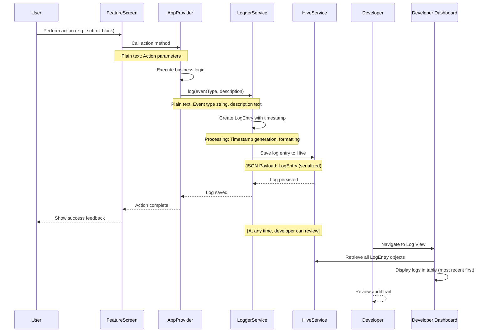
```mermaid
sequenceDiagram
    participant User
    participant FeatureScreen
    participant AppProvider
    participant LoggerService
    participant HiveService

    User->>FeatureScreen: Perform action (e.g., submit block)
    FeatureScreen->>AppProvider: Call action method
    Note over FeatureScreen,AppProvider: Plain text: Action parameters
    AppProvider->>AppProvider: Execute business logic
    AppProvider->>LoggerService: log(eventType, description)
    Note over AppProvider,LoggerService: Plain text: Event type string, description text
    LoggerService->>LoggerService: Create LogEntry with timestamp
    Note over LoggerService: Processing: Timestamp generation, formatting
    LoggerService->>HiveService: Save log entry to Hive
    Note over LoggerService,HiveService: JSON Payload: LogEntry (serialized)
    HiveService-->>LoggerService: Log persisted
    LoggerService-->>AppProvider: Log saved
    AppProvider-->>FeatureScreen: Action complete
    FeatureScreen-->>User: Show success feedback

    Note over LoggerService,HiveService: [At any time, developer can review]
    Developer->>Developer Dashboard: Navigate to Log View
    Developer Dashboard->>HiveService: Retrieve all LogEntry objects
    Developer Dashboard->>Developer Dashboard: Display logs in table (most recent first)
    Developer-->>Developer: Review audit trail
```

---

## 20. Data Persistence & Local Storage

**User Role:** System-level (All Users)

**Screen:** Not visible to users (backend service)

**Functionality:**
All application data is stored locally using Hive database (NoSQL key-value store). This enables offline functionality, fast access, and privacy (data never sent to external servers unless explicitly exported). Data is structured in collections by type (staff, blocks, reports, proposals, meetings, logs, operating hours).

**Data Storage Collections:**
- `staff`: List of StaffMember objects
- `blocks`: List of AvailabilityBlock objects
- `reports`: List of WorkingReport objects
- `proposals`: List of EventProposal objects
- `externalMeetings`: List of ExternalMeetingRequest objects
- `operatingHours`: Single OperatingHours configuration object
- `logs`: List of LogEntry objects

**Async Process Flowchart:**

```mermaid
sequenceDiagram
    participant Application
    participant HiveService
    participant Hive DB
    participant Local Storage

    participant Application: App Initialization
    Application->>HiveService: HiveService.init()
    Note over Application,HiveService: Plain text: Initialize database
    HiveService->>Hive DB: Open Hive database
    Note over HiveService,Hive DB: Local file access
    Hive DB->>Local Storage: Access file system
    Note over Hive DB,Local Storage: File I/O: Read .hive files
    Local Storage-->>Hive DB: File data loaded
    Hive DB-->>HiveService: Database opened
    HiveService-->>Application: Init complete

    Application->>HiveService: getStaff()
    Note over Application,HiveService: Plain text: Retrieve staff collection
    HiveService->>Hive DB: Query 'staff' box
    Note over HiveService,Hive DB: Key-value lookup
    Hive DB->>Local Storage: Read staff entries from disk
    Local Storage-->>Hive DB: Data retrieved
    Hive DB-->>HiveService: Return List[StaffMember]
    Note over Hive DB,HiveService: JSON Array: Deserialized objects
    HiveService-->>Application: Staff list in memory

    Application->>HiveService: saveStaff(staffMember)
    Note over Application,HiveService: JSON Payload: StaffMember object
    HiveService->>Hive DB: Put item in 'staff' box
    Note over HiveService,Hive DB: Key-value write operation
    Hive DB->>Local Storage: Serialize and write to disk
    Note over Hive DB,Local Storage: File I/O: Write .hive file
    Local Storage-->>Hive DB: Data persisted
    Hive DB-->>HiveService: Write complete
    HiveService-->>Application: Save confirmed
```

---

## Summary: User Roles & Feature Access Matrix

| Feature | Senior Staff | Junior Staff | External Visitors | Developer |
|---------|:---:|:---:|:---:|:---:|
| Profile Setup | ✗ | ✓ | ✗ | ✗ |
| Schedule Submission | ✗ | ✓ | ✗ | ✗ |
| Event Proposals (Create) | ✗ | ✓ | ✗ | ✗ |
| Working Reports | ✗ | ✓ | ✗ | ✗ |
| Metrics Dashboard | ✓ | ✗ | ✗ | ✓ |
| Schedule Approval | ✓ | ✗ | ✗ | ✗ |
| Working Reports Review | ✓ | ✗ | ✗ | ✓ |
| Event Proposals (Review) | ✓ | ✗ | ✗ | ✗ |
| External Meetings (Review) | ✓ | ✗ | ✗ | ✗ |
| Operating Hours Config | ✓ | ✗ | ✗ | ✗ |
| Data Export | ✓ | ✗ | ✗ | ✓ |
| Staff Management | ✓ | ✗ | ✗ | ✗ |
| Meeting Request Form | ✗ | ✗ | ✓ | ✗ |
| Chart Analytics | ✓ | ✗ | ✗ | ✓ |
| Social Media Metrics | ✓ | ✗ | ✗ | ✓ |
| System Logs | ✗ | ✗ | ✗ | ✓ |
| Data Import | ✓ | ✗ | ✗ | ✓ |
| Language/Theme Switching | ✓ | ✓ | ✓ | ✓ |

---

**Document Generated:** May 25, 2026

**For Administrative Support:**
- All dates/times are displayed in user's local timezone
- Data exports can be performed monthly for compliance
- System supports unlimited staff members and scheduling entries
- Offline functionality available - application works without internet connection
- All data stored locally on user's device (no cloud required for demo)
--------------
# Hand raised documentation
## Roles
- Main staff
- Student Assistant
  -   International
  -   Japanese
- Visitor

## Process
- Working
  - availability scheduling
  - report generation
- Events
  - meetings
  - cultural events
- Reservations

```mermaid
sequenceDiagram
    autonumber
    actor SA as Student Assistant
    actor MS as Main Staff
    actor HR as Human Resources

    %% STAGE 1
    Note over SA, MS: STAGE 1: Availability Submission (Process: Working)
    SA->>MS: Submit proposed start/end (datetime) & location

    %% STAGE 2
    Note over SA, MS: STAGE 2: Confirmation
    MS->>SA: Evaluate schedule (Approve / Pending / Reject)

    %% STAGE 3 (Shared)
    rect rgba(0, 128, 255, 0.1)
        Note over SA, MS: STAGE 3: Execution [SHARED STAGE]
        SA->>SA: Do assigned tasks, meetings, events, or reservations
    end

    %% STAGE 4 (Shared)
    rect rgba(0, 128, 255, 0.1)
        Note over SA, MS: STAGE 4: Report [SHARED STAGE]
        SA->>MS: Report actual start/end (timestamp) & details (text)
    end

    %% STAGE 5 (Shared)
    rect rgba(0, 128, 255, 0.1)
        Note over MS, HR: STAGE 5: Verification & Submission [SHARED STAGE]
        MS->>MS: Review submitted report & fix errors
        MS->>HR: Submit finalized data to HR
    end
```

```mermaid
graph TB
    %% Definitions
    classDef student fill:#e1f5fe,stroke:#0288d1,stroke-width:2px;
    classDef staff fill:#efebe9,stroke:#5d4037,stroke-width:2px;
    classDef shared fill:#e8f5e9,stroke:#388e3c,stroke-width:2px,stroke-dasharray: 5 5;

    subgraph Process_Working [Process: Working]
        direction TB
        
        subgraph Stage1 [Stage 1: Availability Submission]
            A[Who: Student Assistant<br>Action: Submit start/end datetime & location]:::student
        end

        subgraph Stage2 [Stage 2: Confirmation]
            B[Who: Main Staff<br>Action: Approve, Pending, or Reject schedule]:::staff
        end
    end

    %% SHARED PIPELINE
    subgraph Shared_Stages [Reusable Core Stages]
        subgraph Stage3 [Stage 3: Execution]
            C[Who: Student Assistant<br>Action: Tasks, meetings, reservations]:::student
        end

        subgraph Stage4 [Stage 4: Report]
            D[Who: Student Assistant<br>Action: Log actual timestamps & text report]:::student
        end

        subgraph Stage5 [Stage 5: Verification & Submission]
            E[Who: Main Staff<br>Action: Review, fix errors, submit to HR]:::staff
        end
    end

    %% Connections
    A --> B
    B --> C
    C --> D
    D --> E

    %% Example of another process reusing it
    %% subgraph Process_Event_Hosting [Process: Event Hosting]
    %%    X[Stage 1: Setup] --> Y[Stage 2: Check-in] --> C
    %% end

```


```mermaid
graph LR
    A[Role: Student Assistant] --> B[Stage 3: Shared Execution]
    
    click A call onRoleClick("StudentAssistant") "Click to view all student tasks"
    click B call onStageClick("Stage3") "Click to see all processes using Stage 3"

```

```mermaid
graph TB
    %% Styling Definitions for Roles & Shared Stages
    classDef student fill:#e1f5fe,stroke:#0288d1,stroke-width:2px;
    classDef staff fill:#efebe9,stroke:#5d4037,stroke-width:2px;
    classDef hybrid fill:#f3e5f5,stroke:#7b1fa2,stroke-width:2px;
    classDef shared fill:#e8f5e9,stroke:#388e3c,stroke-width:2px,stroke-dasharray: 5 5;

    %% PROCESS 1: WORKING
    subgraph Process_Working [Process: Working]
        direction TB
        W_Stage1[Stage 1: Availability Submission<br><b>Who:</b> Student Assistant<br>• Submit start/end datetime & location]:::student
        W_Stage2[Stage 2: Confirmation<br><b>Who:</b> Main Staff<br>• Approve, Pending, or Reject schedule]:::staff
        
        W_Stage1 --> W_Stage2
    end

    %% PROCESS 2: EVENT OR MEETING
    subgraph Process_Event [Process: Event or Meeting]
        direction TB
        E_Stage1[Stage 1: Proposal<br><b>Who:</b> Student or Main Staff<br>• Propose datetime, title, location, agenda, roles<br>• Meetings: forced In-Person & Online]:::hybrid
        E_Stage2[Stage 2: Approval<br><b>Who:</b> Main Staff<br>• Approve, reject, or edit/comment]:::staff
        E_Stage3[Stage 3: Notification / Publication<br><b>Who:</b> Main Staff<br>• Create online link for meetings<br>• Post to social media for events]:::staff

        E_Stage1 --> E_Stage2
        E_Stage2 --> E_Stage3
    end

    %% SHARED PIPELINE (Reused by both processes)
    subgraph Shared_Stages [Reusable Core Stages]
        Core_Stage3[Stage 3/4: Execution<br><b>Who:</b> Student and/or Main Staff<br>• Perform assigned tasks, meetings, events]:::hybrid
        Core_Stage4[Stage 4/5: Report<br><b>Who:</b> Student Assistant<br>• Log actual timestamps & text report<br>• Upload media if event]:::student
        Core_Stage5[Stage 5/6: Verification & Submission<br><b>Who:</b> Main Staff<br>• Review, fix errors, submit to HR]:::staff

        Core_Stage3 --> Core_Stage4
        Core_Stage4 --> Core_Stage5
    end

    %% Connecting the distinct entry processes into the Shared Pipeline
    W_Stage2 --> Core_Stage3
    E_Stage3 --> Core_Stage3

```

```mermaid
graph TB
    %% Styling Definitions for Roles & Shared Stages
    classDef student fill:#e1f5fe,stroke:#0288d1,stroke-width:2px;
    classDef staff fill:#efebe9,stroke:#5d4037,stroke-width:2px;
    classDef visitor fill:#fff3e0,stroke:#ffb74d,stroke-width:2px;
    classDef hybrid fill:#f3e5f5,stroke:#7b1fa2,stroke-width:2px;

    %% PROCESS 1: WORKING
    subgraph Process_Working [Process: Working]
        direction TB
        W_Stage1[Stage 1: Availability Submission<br><b>Who:</b> Student Assistant<br>• Submit start/end datetime & location]:::student
        W_Stage2[Stage 2: Confirmation<br><b>Who:</b> Main Staff<br>• Approve, Pending, or Reject schedule]:::staff
        
        W_Stage1 --> W_Stage2
    end

    %% PROCESS 2: EVENT OR MEETING
    subgraph Process_Event [Process: Event or Meeting]
        direction TB
        E_Stage1[Stage 1: Proposal<br><b>Who:</b> Student or Main Staff<br>• Propose datetime, title, location, agenda, roles<br>• Meetings: forced In-Person & Online]:::hybrid
        E_Stage2[Stage 2: Approval<br><b>Who:</b> Main Staff<br>• Approve, reject, or edit/comment]:::staff
        E_Stage3[Stage 3: Notification / Publication<br><b>Who:</b> Main Staff<br>• Create online link for meetings<br>• Post to social media for events]:::staff

        E_Stage1 --> E_Stage2
        E_Stage2 --> E_Stage3
    end

    %% PROCESS 3: RESERVATION
    subgraph Process_Reservation [Process: Reservation]
        direction TB
        R_Stage1[Stage 1: Request<br><b>Who:</b> External Visitor / University Staff<br>• Send start/end timestamps, location, purpose<br>• Select target language & report request]:::visitor
        R_Stage2[Stage 2: Assignation<br><b>Who:</b> Main Staff<br>• Match request with approved Student Availability]:::staff

        R_Stage1 --> R_Stage2
    end

    %% SHARED PIPELINE (Reused by all three processes)
    subgraph Shared_Stages [Reusable Core Stages]
        Core_Stage3[Stage 3: Execution<br><b>Who:</b> Student and/or Main Staff<br>• Perform assigned tasks, meetings, events, or reservation duties]:::hybrid
        Core_Stage4[Stage 4: Report<br><b>Who:</b> Student Assistant<br>• Log actual timestamps & text report<br>• Upload media if event / generate visitor report if requested]:::student
        Core_Stage5[Stage 5: Verification & Submission<br><b>Who:</b> Main Staff<br>• Review, fix errors, submit to HR]:::staff

        Core_Stage3 --> Core_Stage4
        Core_Stage4 --> Core_Stage5
    end

    %% Connecting all three distinct entry processes into the Shared Pipeline
    W_Stage2 --> Core_Stage3
    E_Stage3 --> Core_Stage3
    R_Stage2 --> Core_Stage3

```

```mermaid
graph TB
    %% 高コントラスト・アクセシビリティ対応のスタイリング定義（テキストの視認性を最優先）

    %% プロセス 1: 勤務 (WORKING)
    subgraph Process_Working [プロセス: 勤務]
        direction TB
        W_Stage1[ステージ 1: 勤務可能日時の提出<br><b>担当:</b> 学生アシスタント<br>• 希望開始/終了日時および勤務形態・場所の提出]:::student
        W_Stage2[ステージ 2: 確定・承認<br><b>担当:</b> メインスタッフ<br>• スケジュールの承認、保留、または却下]:::staff
        
        W_Stage1 --> W_Stage2
    end

    %% プロセス 2: イベントまたは会議 (EVENT OR MEETING)
    subgraph Process_Event [プロセス: イベントまたは会議]
        direction TB
        E_Stage1[ステージ 1: 企画・提案<br><b>担当:</b> 学生またはメインスタッフ<br>• 日時、タイトル、場所、議題、役割の提案<br>• 会議の場合: 区分は常に「対面＆オンライン」両方]:::hybrid
        E_Stage2[ステージ 2: 承認・審査<br><b>担当:</b> メインスタッフ<br>• 提案の承認、却下、および編集/コメント]:::staff
        E_Stage3[ステージ 3: 通知・告知<br><b>担当:</b> メインスタッフ<br>• 会議用オンラインリンクの作成<br>• イベント用のSNS告知・掲載]:::staff

        E_Stage1 --> E_Stage2
        E_Stage2 --> E_Stage3
    end

    %% プロセス 3: 予約 (RESERVATION)
    subgraph Process_Reservation [プロセス: 予約]
        direction TB
        R_Stage1[ステージ 1: 予約リクエスト<br><b>担当:</b> 外部訪問者 / 学内・社内スタッフ<br>• 希望開始/終了日時、場所、目的の送信<br>• 対象言語の選択およびレポート要求の有無]:::visitor
        R_Stage2[ステージ 2: 割り当て・マッチング<br><b>担当:</b> メインスタッフ<br>• 承認済みの学生勤務可能データから最適な学生を選定]:::staff

        R_Stage1 --> R_Stage2
    end

    %% 共通パイプライン (3つのプロセスすべてで再利用)
    subgraph Shared_Stages [再利用されるコアステージ]
        Core_Stage3[ステージ 3: 実施・実行<br><b>担当:</b> 学生 および/または メインスタッフ<br>• 割り当てられた業務、会議、イベント、または予約対応の実行]:::hybrid
        Core_Stage4[ステージ 4: レポート・報告<br><b>担当:</b> 学生アシスタント<br>• 実際の稼働タイムスタンプと詳細テキストの記録<br>• イベント時のメディア適宜アップロード / 要求時の訪問者レポート生成]:::student
        Core_Stage5[ステージ 5: 確認および提出<br><b>担当:</b> メインスタッフ<br>• 提出されたレポートの確認、エラー修正、人事（HR）への提出]:::staff

        Core_Stage3 --> Core_Stage4
        Core_Stage4 --> Core_Stage5
    end

    %% 各プロセスから共通パイプラインへの接続
    W_Stage2 --> Core_Stage3
    E_Stage3 --> Core_Stage3
    R_Stage2 --> Core_Stage3
```