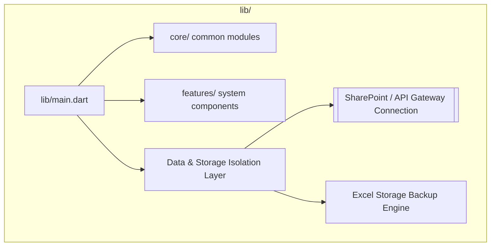

# 🗺️ System Blueprint (Auto-Generated from Flutter Codebase)

This documentation maps out your structural layers directly from your local codebase configuration.

---

## 1. Modular Application Architecture Map
This layout visually separates your presentation layer from the core storage logic.


---

## 2. Dynamic Development Timeline Log
Generated directly from code tags and version changes.

```mermaid
gantt
    title Historical Git Activity Track
    dateFormat  YYYY-MM-DD
    section Commit Milestones
    Documentation about flutter project  active, 2026-05-25, 3d
    documentation for building the web page files for github pages from the flutter project  active, 2026-05-25, 3d
    presentation made to hatsuda and sugawara, base for implementation  active, 2026-05-23, 3d
    data cleaning script  working schedules availability and approved   active, 2026-05-21, 3d
    notes after hatsuda-san and sugawara-san meeting  active, 2026-05-20, 3d
```
