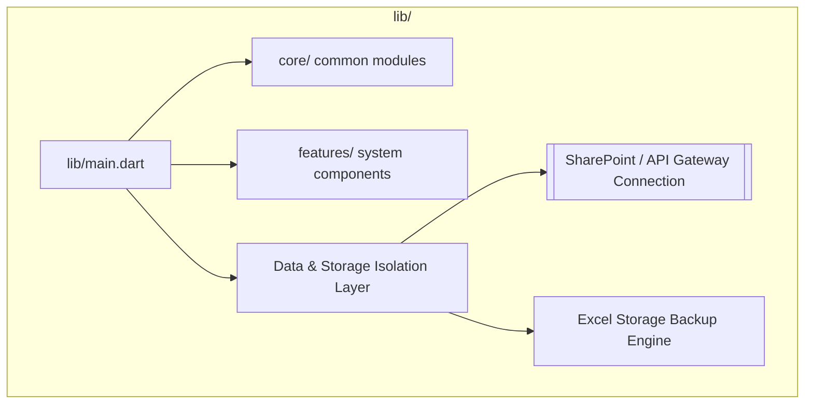

# 🗺️ System Blueprint (Auto-Generated from Flutter Codebase)

This documentation maps out your structural layers directly from your local codebase configuration.

---

## 1. Modular Application Architecture Map
This layout visually separates your presentation layer from the core storage logic.


---

## 2. Dynamic Development Timeline Log
Generated directly from code tags and version changes.

```mermaid
gantt
    title Historical Git Activity Track
    dateFormat  YYYY-MM-DD
    section Commit Milestones
    added reservation page calendar and form pull data from sharepoint  active, 2026-06-02, 3d
    updating devcontainer to fix issues with the github codespace  active, 2026-06-02, 3d
    fixing issues with github container creation  active, 2026-06-02, 3d
    minor fixes dart version limitations added vscode for building web UI whe building from github codespace  active, 2026-06-02, 3d
    update flutter version to match SDK environment  active, 2026-06-02, 3d
```
