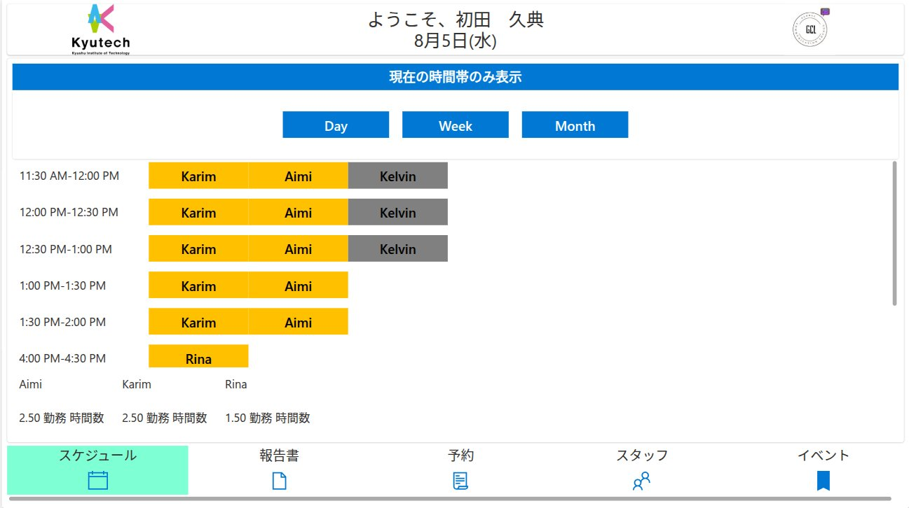
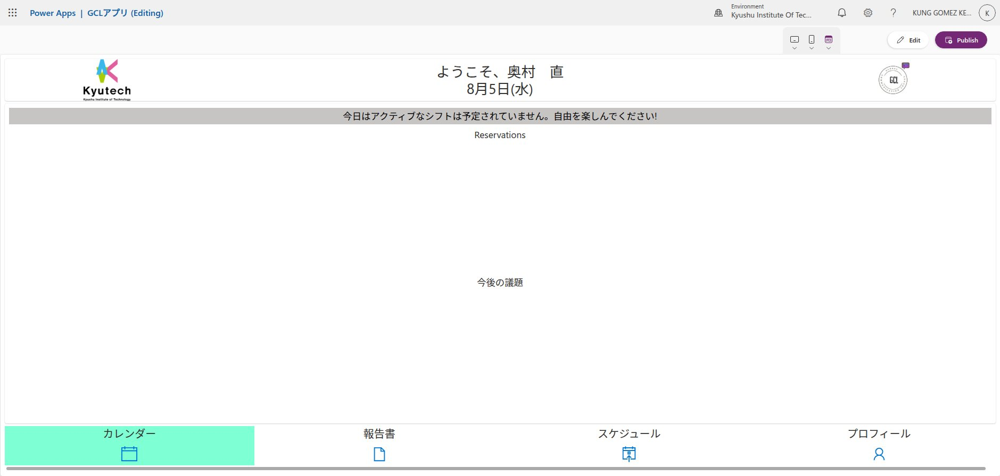
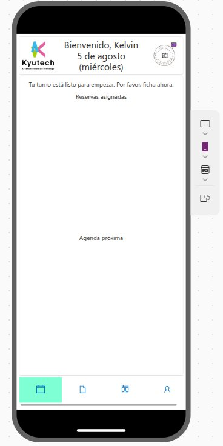

This document will present how to use the UI interface for both power apps and flutter

# Power Apps
## Senior staff
This are the people who manage student staff
### Screens
- Schedule
- Reports
- Reservations
- Staff
- Activities
#### Schedule
Shows today's agenda (student staff, events and reservations)

## Student staff
This are the international and japanese students who interact, help and provide assistance in the events and activities 

### Screens
- Calendar
- Reports
- Schedules
- Profile

#### Calendar
Shows the information for the day, including assigned reservations and upcoming activities (events and meetings)

This is the student staff who will help/assist in providing the communication with visiting students
- submitting working schedule (for next month)
- submitting working report (for ongoing month)
- handling reservation
- 
# Developer/programmer
Tools:
- power automate
- [excel office scripts](../excel2SharepointList.md)
- power apps