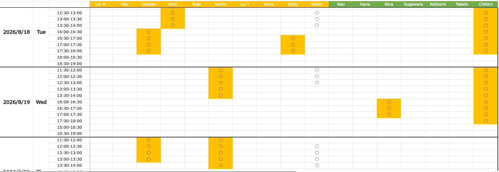
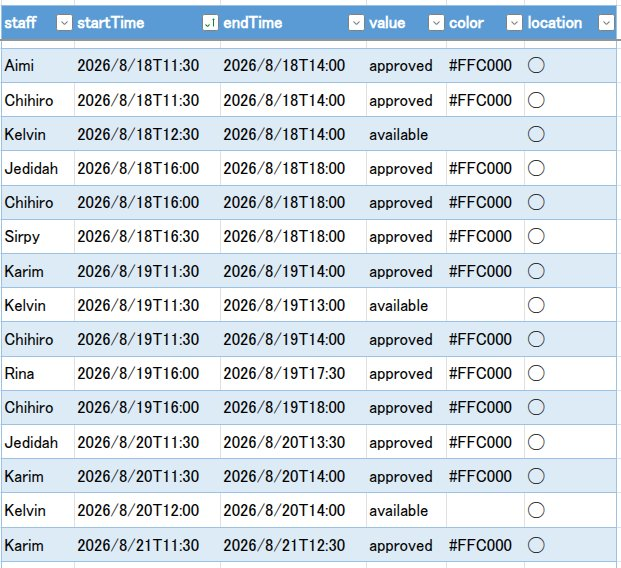
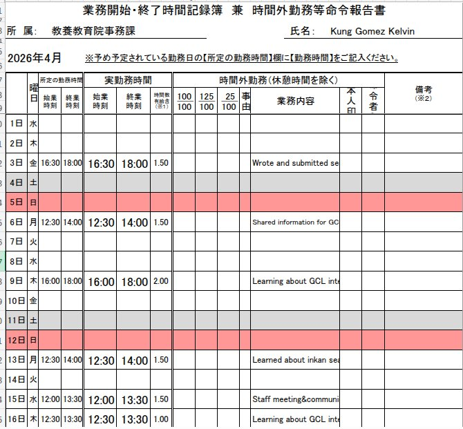
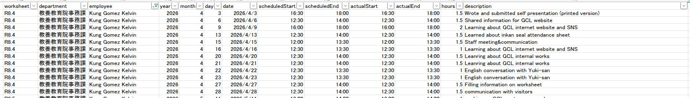

# Office Scripts
This script is made to read the Excel file to export data in json format to power automate to save into Sharepoint List  (data flattening)

View link [How to implement this script](https://learn.microsoft.com/ja-jp/office/dev/scripts/overview/excel)

## Working schedules



### code

```
function main(workbook: ExcelScript.Workbook) {

  const ws = workbook.getWorksheet("All");
  if (!ws) throw new Error('Worksheet "All" not found.');

  const used = ws.getUsedRange();
  if (!used) return;

  const firstRow = used.getRowIndex() + 1;
  const firstColumn = used.getColumnIndex() + 1;

  const texts = used.getTexts();

  const header = texts[0];
  const values = texts.slice(1);

  const result: {
    staff: string;
    startTime: string;
    endTime: string;
    value: string;
    color: string;
  }[] = [];

  let currentDate = "";

  for (let a = 0; a < header.length; a++) {

    if (!header[a]) continue;

    for (let b = 0; b < values.length; b++) {

      if (values[b][0]) {
        currentDate = values[b][0];
      }

      if (!values[b][a] || !values[b][2]) continue;

      const row = b + firstRow + 1;
      const column = a + firstColumn;

      const color = ws
        .getCell(row - 1, column - 1)
        .getFormat()
        .getFill()
        .getColor();

      const times = values[b][2].split("-");

      result.push({
        staff: header[a],
        startTime: `${currentDate}T${times[0]}`,
        endTime: `${currentDate}T${times[1]}`,
        value: color ? "approved" : "available",
        color
      });
    }
  }
  const merged: {
    staff: string,
    startTime: string,
    endTime: string,
    color: string,
    value: string
  }[] = [];

  for (const item of result) {
    const last = merged[merged.length - 1];

    if (
      last &&
      last.staff === item.staff &&
      last.value === item.value &&
      last.color === item.color &&
      last.endTime === item.startTime
    ) {
      last.endTime = item.endTime;
    } else {
      merged.push({ 
        staff:item.staff,
        startTime:item.startTime,
        endTime:item.endTime,
        value:item.value,
        color:item.color
      });
    }
  }

  return {
    count: result.length,
    data: result,
    processed: merged
  };
}
```


## Working reports



### code
```
function main(workbook: ExcelScript.Workbook) {

    type TimesheetRecord = {
        worksheet: string;
        department: string;
        employee: string;
        year: number;
        month: number;
        day: number;
        date: string;
        scheduledStart: string;
        scheduledEnd: string;
        actualStart: string;
        actualEnd: string;
        hours: number;
        description: string;
    };

    const records: TimesheetRecord[] = [];

    // Safe cell reader
    function cell(data: string[][], row: number, col: number): string {
        return data[row]?.[col]?.toString().trim() ?? "";
    }

    for (const sheet of workbook.getWorksheets()) {

        const used = sheet.getUsedRange();
        if (!used) continue;

        const t = used.getTexts();

        // ---------------------------------------------------------------------
        // Metadata
        // ---------------------------------------------------------------------

        const department = cell(t, 2, 4);
        const employee = cell(t, 2, 29);

        const monthText = cell(t, 4, 0);

        const match = monthText.match(/(\d+)年\s*(\d+)月/);

        if (!match) {
            continue;
        }

        const year = Number(match[1]);
        const month = Number(match[2]);

        // ---------------------------------------------------------------------
        // Daily records
        // ---------------------------------------------------------------------

        for (let r = 9; r < t.length; r++) {

            const dayText = cell(t, r, 0);

            // Stop when totals section begins
            if (dayText === "合計時間") {
                break;
            }

            // Skip anything that isn't "1日", "2日"... etc.
            const dayMatch = dayText.match(/^(\d+)日$/);

            if (!dayMatch) {
                continue;
            }

            const day = Number(dayMatch[1]);

            const scheduledStart = cell(t, r, 3);
            const scheduledEnd = cell(t, r, 5);

            const actualStart = cell(t, r, 7);
            const actualEnd = cell(t, r, 10);

            const hoursText = cell(t, r, 13);

            const description = cell(t, r, 22);

            // Ignore completely empty rows
            if (
                scheduledStart === "" &&
                scheduledEnd === "" &&
                actualStart === "" &&
                actualEnd === "" &&
                hoursText === "" &&
                description === ""
            ) {
                continue;
            }

            records.push({
                worksheet: sheet.getName(),
                department,
                employee,
                year,
                month,
                day,
                date:
                    `${year}-` +
                    `${String(month).padStart(2, "0")}-` +
                    `${String(day).padStart(2, "0")}`,
                scheduledStart,
                scheduledEnd,
                actualStart,
                actualEnd,
                hours: parseFloat(hoursText) || 0,
                description
            });
        }
    }

    return records;
}
```

## Reservations