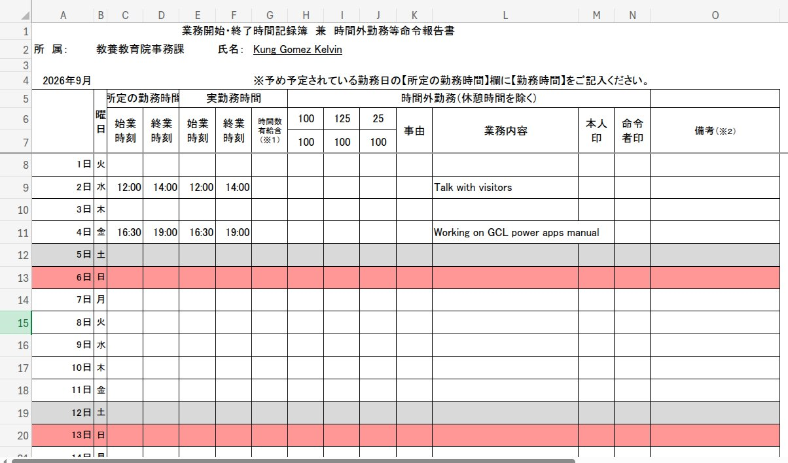

# Office Script 
This script is made to read the Excel file to export data in json format to power automate to save into Sharepoint List  (data flattening)

View link [How to implement this script](https://learn.microsoft.com/ja-jp/office/dev/scripts/overview/excel)

## Working reports 


### Office script
receives json from Power automate
```
interface ScheduleItem {
    date?: string;
    scheduledStart?: string;
    scheduledEnd?: string;
    actualStart?: string;
    actualEnd?: string;
    description?: string;
}

function main(
    workbook: ExcelScript.Workbook,
    inputJson: string,
    reiwaYear: number,
    monthNumber: number) {

    // Parse the incoming JSON array payload
    const items: ScheduleItem[] = typeof inputJson === "string" ? JSON.parse(inputJson) : inputJson;

    const sheetName = `R${reiwaYear}.${monthNumber}`;
    const sheet = workbook.getWorksheet(sheetName);
    if (!sheet) {
        console.log(`Sheet "${sheetName}" was not found.`);
        return;
    }

    // Read day numbers from column A (rows 7 through 39)
    const dayRange = sheet.getRange("A8:A38");
    const dayValues = dayRange.getTexts();
    console.log(dayValues);

    // Helper function to extract "HH:mm" from ISO time strings
    const extractTime = (isoString?: string) => {
        if (!isoString) return "";
        const parts = isoString.split("T");
        if (parts.length < 2) return "";
        return parts[1].substring(0, 5);
    };

    // Loop through each item in the parsed array
    for (let item of items) {
        if (!item.date) continue;
        console.log(item)
        const targetDay = new Date(item.date).getDate();
        let targetRowIndex = -1;

        for (let i = 0; i < dayValues.length; i++) {
            const cellValue = String(dayValues[i][0] || "").trim();
            // parseInt extracts the number from strings like "2日" (e.g., parseInt("2日") -> 2)
            const cellDayNum = parseInt(cellValue, 10);
            console.log(cellDayNum);
            console.log(targetDay);
            if (cellDayNum === targetDay) {
                targetRowIndex = 8 + i; // Excel row index (1-based, starting at row 7)
                break;
            }
        }

        console.log(targetRowIndex)
        // Write values into the matched row if found
        if (targetRowIndex !== -1) {
            sheet.getRange(`C${targetRowIndex}`).setValue(extractTime(item.scheduledStart));
            sheet.getRange(`D${targetRowIndex}`).setValue(extractTime(item.scheduledEnd));
            sheet.getRange(`E${targetRowIndex}`).setValue(extractTime(item.actualStart));
            sheet.getRange(`F${targetRowIndex}`).setValue(extractTime(item.actualEnd));
            sheet.getRange(`L${targetRowIndex}`).setValue(item.description || "");
        }
    }
}
```
### Highlight formulas
For applying highligh formulas in excel [visit link](https://support.microsoft.com/en-us/excel/use-conditional-formatting-to-highlight-information-in-excel)


For highlighting gray (sunday)
```
=WEEKDAY($A8,2)=6
```
For highlight red (sunday)
```
=WEEKDAY($A8,2)=7
```