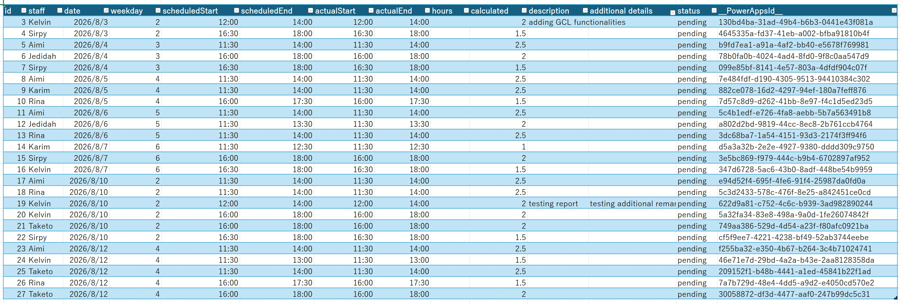

# Office Script 
This script is made to read the Excel file to export data in json format to power automate to save into Sharepoint List  (data flattening)

View link [How to implement this script](https://learn.microsoft.com/ja-jp/office/dev/scripts/overview/excel)

## Working reports 
