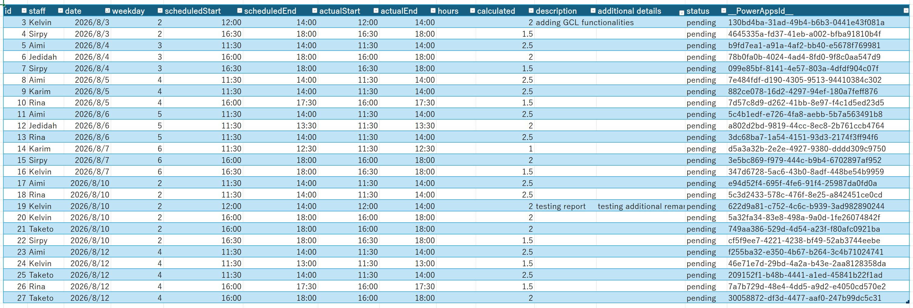
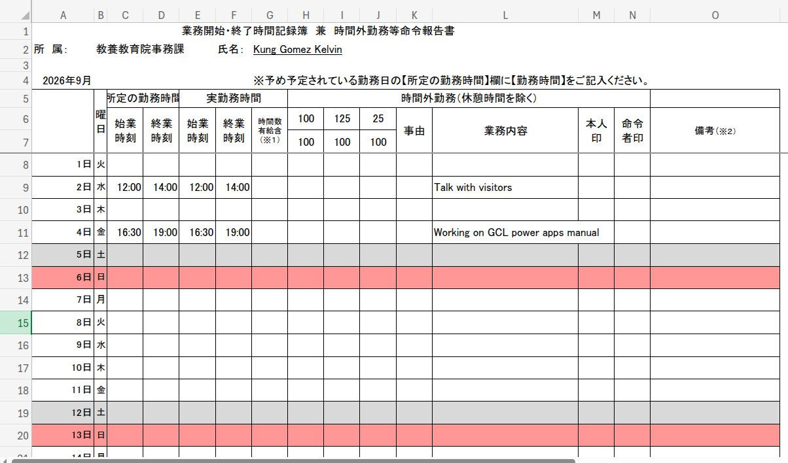

# Office Script 
This script is made to read the Excel file to export data in json format to power automate to save into Sharepoint List  (data flattening)

View link [How to implement this script](https://learn.microsoft.com/ja-jp/office/dev/scripts/overview/excel)

## Working reports 


### Office script
receives json from Power automate
```
interface ScheduleItem {
    date?: string;
    scheduledStart?: string;
    scheduledEnd?: string;
    actualStart?: string;
    actualEnd?: string;
    description?: string;
}

function main(
    workbook: ExcelScript.Workbook,
    inputJson: string,
    reiwaYear: number,
    monthNumber: number) {

    // Parse the incoming JSON array payload
    const items: ScheduleItem[] = typeof inputJson === "string" ? JSON.parse(inputJson) : inputJson;

    const sheetName = `R${reiwaYear}.${monthNumber}`;
    const sheet = workbook.getWorksheet(sheetName);
    if (!sheet) {
        console.log(`Sheet "${sheetName}" was not found.`);
        return;
    }

    // Read day numbers from column A (rows 7 through 39)
    const dayRange = sheet.getRange("A8:A38");
    const dayValues = dayRange.getTexts();
    console.log(dayValues);

    // Helper function to extract "HH:mm" from ISO time strings
    const extractTime = (isoString?: string) => {
        if (!isoString) return "";
        const parts = isoString.split("T");
        if (parts.length < 2) return "";
        return parts[1].substring(0, 5);
    };

    // Loop through each item in the parsed array
    for (let item of items) {
        if (!item.date) continue;
        console.log(item)
        const targetDay = new Date(item.date).getDate();
        let targetRowIndex = -1;

        for (let i = 0; i < dayValues.length; i++) {
            const cellValue = String(dayValues[i][0] || "").trim();
            // parseInt extracts the number from strings like "2日" (e.g., parseInt("2日") -> 2)
            const cellDayNum = parseInt(cellValue, 10);
            console.log(cellDayNum);
            console.log(targetDay);
            if (cellDayNum === targetDay) {
                targetRowIndex = 8 + i; // Excel row index (1-based, starting at row 7)
                break;
            }
        }

        console.log(targetRowIndex)
        // Write values into the matched row if found
        if (targetRowIndex !== -1) {
            sheet.getRange(`C${targetRowIndex}`).setValue(extractTime(item.scheduledStart));
            sheet.getRange(`D${targetRowIndex}`).setValue(extractTime(item.scheduledEnd));
            sheet.getRange(`E${targetRowIndex}`).setValue(extractTime(item.actualStart));
            sheet.getRange(`F${targetRowIndex}`).setValue(extractTime(item.actualEnd));
            sheet.getRange(`L${targetRowIndex}`).setValue(item.description || "");
        }
    }
}
```
### Highlight formulas
For applying highligh formulas in excel [visit link](https://support.microsoft.com/en-us/excel/use-conditional-formatting-to-highlight-information-in-excel)


For highlighting gray (saturday)
```
=WEEKDAY($A8,2)=6
```
For highlight red (sunday)
```
=WEEKDAY($A8,2)=7
```

### Creating tabular presentation 
```
function main(workbook: ExcelScript.Workbook) {
	let selectedSheet = workbook.getActiveWorksheet();
	selectedSheet.setName("R8.9");

	// Set Headers
	selectedSheet.getRange("C1").setValue("業務開始・終了時間記録簿　兼　時間外勤務等命令報告書");
	selectedSheet.getRange("A2").setValue("所　属：");
	selectedSheet.getRange("B2").setValue("教養教育院事務課");
	selectedSheet.getRange("F2").setValue("氏名：");
	selectedSheet.getRange("G2").setValue("student name");
	selectedSheet.getRange("A4").setFormulaLocal("2026/9/1");
	selectedSheet.getRange("G4").setValue("※予め予定されている勤務日の【所定の勤務時間】欄に【勤務時間】をご記入ください。");
	selectedSheet.getRange("B5").setValue("曜日");
	// Merge range R5:R7 on selectedSheet
	selectedSheet.getRange("B5:B7").merge(false);
	selectedSheet.getRange("B5:B7").getFormat().setHorizontalAlignment(ExcelScript.HorizontalAlignment.center);

	selectedSheet.getRange("C5").setValue("所定の勤務時間");
	// Merge range R5:R7 on selectedSheet
	selectedSheet.getRange("C5:D5").merge(false);
	selectedSheet.getRange("C5:D5").getFormat().setHorizontalAlignment(ExcelScript.HorizontalAlignment.center);
	selectedSheet.getRange("E5").setValue("実勤務時間");
	// Merge range R5:R7 on selectedSheet
	selectedSheet.getRange("E5:G5").merge(false);
	selectedSheet.getRange("E5:G5").getFormat().setHorizontalAlignment(ExcelScript.HorizontalAlignment.center);

	selectedSheet.getRange("H5").setValue("時間外勤務（休憩時間を除く）");
	// Merge range R5:R7 on selectedSheet
	selectedSheet.getRange("H5:N5").merge(false);
	selectedSheet.getRange("H5:N5").getFormat().setHorizontalAlignment(ExcelScript.HorizontalAlignment.center);

	selectedSheet.getRange("C6").setValue("始業時刻");
	// Merge range R5:R7 on selectedSheet
	selectedSheet.getRange("C6:C7").merge(false);
	selectedSheet.getRange("C6:C7").getFormat().setHorizontalAlignment(ExcelScript.HorizontalAlignment.center);
	selectedSheet.getRange("D6").setValue("終業時刻");
	selectedSheet.getRange("D6:D7").merge(false);
	selectedSheet.getRange("D6:D7").getFormat().setHorizontalAlignment(ExcelScript.HorizontalAlignment.center);
	selectedSheet.getRange("E6").setValue("始業時刻");
	selectedSheet.getRange("E6:E7").merge(false);
	selectedSheet.getRange("E6:E7").getFormat().setHorizontalAlignment(ExcelScript.HorizontalAlignment.center);
	selectedSheet.getRange("F6").setValue("終業時刻");
	selectedSheet.getRange("F6:F7").merge(false);
	selectedSheet.getRange("F6:F7").getFormat().setHorizontalAlignment(ExcelScript.HorizontalAlignment.center);
	selectedSheet.getRange("G6").setValue("時間数有給含（※１）");
	selectedSheet.getRange("G6:G7").merge(false);
	selectedSheet.getRange("G6:G7").getFormat().setHorizontalAlignment(ExcelScript.HorizontalAlignment.center);
	selectedSheet.getRange("H6").setValue("100");
	selectedSheet.getRange("H7").setValue("100");
	selectedSheet.getRange("I6").setValue("125");
	selectedSheet.getRange("I7").setValue("100");
	selectedSheet.getRange("J6").setValue("25");
	selectedSheet.getRange("J7").setValue("100");

	selectedSheet.getRange("K6").setValue("事由");
	selectedSheet.getRange("K6:K7").merge(false);
	selectedSheet.getRange("K6:K7").getFormat().setHorizontalAlignment(ExcelScript.HorizontalAlignment.center);

	selectedSheet.getRange("L6").setValue("業務内容");
	selectedSheet.getRange("L6:L7").merge(false);
	selectedSheet.getRange("L6:L7").getFormat().setHorizontalAlignment(ExcelScript.HorizontalAlignment.center);

	selectedSheet.getRange("M6").setValue("本人印");
	selectedSheet.getRange("M6:M7").merge(false);
	selectedSheet.getRange("M6:M7").getFormat().setHorizontalAlignment(ExcelScript.HorizontalAlignment.center);

	selectedSheet.getRange("N6").setValue("命令者印");
	selectedSheet.getRange("N6:N7").merge(false);
	selectedSheet.getRange("N6:N7").getFormat().setHorizontalAlignment(ExcelScript.HorizontalAlignment.center);

	selectedSheet.getRange("O6").setValue("備考（※２）");
	selectedSheet.getRange("O6:O7").merge(false);
	selectedSheet.getRange("O6:O7").getFormat().setHorizontalAlignment(ExcelScript.HorizontalAlignment.center);

	// Set range Q8:Q9 on selectedSheet
	selectedSheet.getRange("A8:A9").setFormulasLocal([["=A4"],["=A8+1"]]);
	// Auto fill range
	selectedSheet.getRange("A9").autoFill("A9:A37", ExcelScript.AutoFillType.fillCopy);
	
	// Set range Q8:Q9 on selectedSheet
	selectedSheet.getRange("B8").setFormulasLocal([["=A8"]]);
	// Auto fill range
	selectedSheet.getRange("B8").autoFill("B8:B37", ExcelScript.AutoFillType.fillCopy);

	// Set range Q39 on selectedSheet
	selectedSheet.getRange("F39").setValue("会計時間");
	// Set range W39 on selectedSheet
	selectedSheet.getRange("G39").setFormulaLocal("=SUM(G8:G38)");
	selectedSheet.getRange("H39").setFormulaLocal("=SUM(H8:H38)");
	selectedSheet.getRange("I39").setFormulaLocal("=SUM(I8:I38)");
	selectedSheet.getRange("J39").setFormulaLocal("=SUM(J8:J38)");

	
	// Set border for range A5:O38 on selectedSheet
	selectedSheet.getRange("A5:O38").getFormat().getRangeBorder(ExcelScript.BorderIndex.insideHorizontal).setStyle(ExcelScript.BorderLineStyle.continuous);
	selectedSheet.getRange("A5:O38").getFormat().getRangeBorder(ExcelScript.BorderIndex.insideHorizontal).setColor("000000");
	selectedSheet.getRange("A5:O38").getFormat().getRangeBorder(ExcelScript.BorderIndex.insideHorizontal).setWeight(ExcelScript.BorderWeight.thin);
	selectedSheet.getRange("A5:O38").getFormat().getRangeBorder(ExcelScript.BorderIndex.insideVertical).setStyle(ExcelScript.BorderLineStyle.continuous);
	selectedSheet.getRange("A5:O38").getFormat().getRangeBorder(ExcelScript.BorderIndex.insideVertical).setColor("000000");
	selectedSheet.getRange("A5:O38").getFormat().getRangeBorder(ExcelScript.BorderIndex.insideVertical).setWeight(ExcelScript.BorderWeight.thin);
	selectedSheet.getRange("A5:O38").getFormat().getRangeBorder(ExcelScript.BorderIndex.edgeBottom).setStyle(ExcelScript.BorderLineStyle.continuous);
	selectedSheet.getRange("A5:O38").getFormat().getRangeBorder(ExcelScript.BorderIndex.edgeBottom).setColor("000000");
	selectedSheet.getRange("A5:O38").getFormat().getRangeBorder(ExcelScript.BorderIndex.edgeBottom).setWeight(ExcelScript.BorderWeight.thin);
	selectedSheet.getRange("A5:O38").getFormat().getRangeBorder(ExcelScript.BorderIndex.edgeTop).setStyle(ExcelScript.BorderLineStyle.continuous);
	selectedSheet.getRange("A5:O38").getFormat().getRangeBorder(ExcelScript.BorderIndex.edgeTop).setColor("000000");
	selectedSheet.getRange("A5:O38").getFormat().getRangeBorder(ExcelScript.BorderIndex.edgeTop).setWeight(ExcelScript.BorderWeight.thin);
	selectedSheet.getRange("A5:O38").getFormat().getRangeBorder(ExcelScript.BorderIndex.edgeLeft).setStyle(ExcelScript.BorderLineStyle.continuous);
	selectedSheet.getRange("A5:O38").getFormat().getRangeBorder(ExcelScript.BorderIndex.edgeLeft).setColor("000000");
	selectedSheet.getRange("A5:O38").getFormat().getRangeBorder(ExcelScript.BorderIndex.edgeLeft).setWeight(ExcelScript.BorderWeight.thin);
	selectedSheet.getRange("A5:O38").getFormat().getRangeBorder(ExcelScript.BorderIndex.edgeRight).setStyle(ExcelScript.BorderLineStyle.continuous);
	selectedSheet.getRange("A5:O38").getFormat().getRangeBorder(ExcelScript.BorderIndex.edgeRight).setColor("000000");
	selectedSheet.getRange("A5:O38").getFormat().getRangeBorder(ExcelScript.BorderIndex.edgeRight).setWeight(ExcelScript.BorderWeight.thin);

	let conditionalFormatting: ExcelScript.ConditionalFormat;
	// Create custom from range A9:O39 on selectedSheet
	conditionalFormatting = selectedSheet.getRange("A9:O38").addConditionalFormat(ExcelScript.ConditionalFormatType.custom);
	conditionalFormatting.getCustom().getFormat().getFont().setColor("#001600");
	conditionalFormatting.getCustom().getFormat().getFill().setColor("#ff9797");
	conditionalFormatting.getCustom().getRule().setFormula("=Weekday($A9,2)=6");

	// Create custom from range A9:O39 on selectedSheet
	conditionalFormatting = selectedSheet.getRange("A9:O38").addConditionalFormat(ExcelScript.ConditionalFormatType.custom);
	conditionalFormatting.getCustom().getFormat().getFont().setColor("#001600");
	conditionalFormatting.getCustom().getFormat().getFill().setColor("#d9d9d9");
	conditionalFormatting.getCustom().getRule().setFormula("=Weekday($A9,2)=7");

	
	// Set format for extended range obtained by extending down from range B8 on selectedSheet
	selectedSheet.getRange("B8").getExtendedRange(ExcelScript.KeyboardDirection.down).setNumberFormatLocal("aaa");

	selectedSheet.getRange("B42").setValue("命令者：");
	selectedSheet.getRange("D42").setValue("山中　剛");
	selectedSheet.getRange("G44").setFormulaLocal("=COUNTA(G8:G37)");

	selectedSheet.getRange("I44").setValue("勤務");
	selectedSheet.getRange("I45").setValue("時間数");
	selectedSheet.getRange("J44").setFormulaLocal("=G39");
	selectedSheet.getRange("J44:J45").merge(false);
	selectedSheet.getRange("J44:J45").getFormat().setHorizontalAlignment(ExcelScript.HorizontalAlignment.center);

	selectedSheet.getRange("K44").setValue("100");
	selectedSheet.getRange("K45").setValue("100");
	selectedSheet.getRange("L44").setFormulaLocal("=H39");
	selectedSheet.getRange("L44:L45").merge(false);
	selectedSheet.getRange("L44:L45").getFormat().setHorizontalAlignment(ExcelScript.HorizontalAlignment.center);

	selectedSheet.getRange("M44").setValue("125");
	selectedSheet.getRange("M45").setValue("100");
	selectedSheet.getRange("N44").setFormulaLocal("=I39");
	selectedSheet.getRange("N44:N45").merge(false);
	selectedSheet.getRange("N44:N45").getFormat().setHorizontalAlignment(ExcelScript.HorizontalAlignment.center);

	selectedSheet.getRange("O44").setValue("25");
	selectedSheet.getRange("O45").setValue("100");
	selectedSheet.getRange("P44").setFormulaLocal("=J39");
	selectedSheet.getRange("P44:P45").merge(false);
	selectedSheet.getRange("P44:P45").getFormat().setHorizontalAlignment(ExcelScript.HorizontalAlignment.center);

	selectedSheet.getRange("A4").setNumberFormatLocal("yyyy年-mm月");
}
```